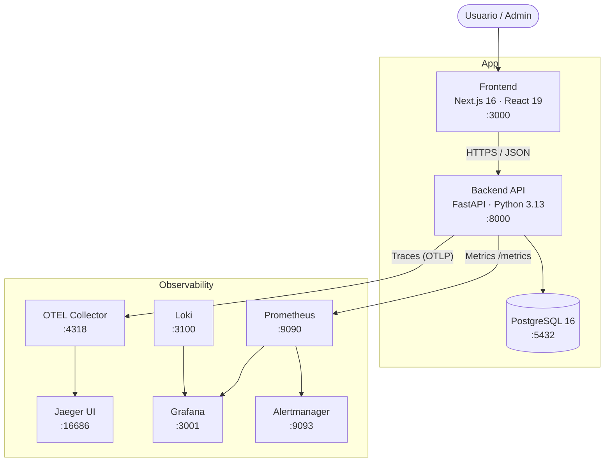

# Ideas Tracker

A full-stack web platform to capture, prioritize, execute and close project ideas — with complete traceability from conception to final evaluation.

Built with an architecture: hexagonal backend, React/Next.js frontend, JWT auth, full observability stack, and automated CI/CD.

---

## What it does

- **Capture ideas** — create ideas with title, description and optional category.
- **Track execution** — update `execution_percentage` (0–100) and lifecycle state (`idea → in_progress → terminada`).
- **Progress logs** — add timestamped comments as a project journal, with author traceability.
- **Final rating** — rate the outcome (1–5) once an idea is completed, for continuous learning.
- **Authentication** — login via OAuth2 Password Flow with JWT access + refresh tokens.
- **Role-based access** — `admin` and `user` roles with route guards on frontend and backend.
- **Observability** — distributed traces, metrics and structured logs available out of the box.

---

## Tech Stack

### Backend

| Layer | Technology |
|-------|-----------|
| Language | Python 3.13 |
| Framework | FastAPI + Uvicorn |
| Package manager | [uv](https://docs.astral.sh/uv/) |
| ORM | SQLAlchemy 2.x |
| Migrations | Alembic |
| Database | PostgreSQL 16 |
| Auth | JWT (`python-jose`) + Argon2 password hashing (`passlib`) |
| Rate limiting | SlowAPI |
| Linting | Ruff |

### Frontend

| Layer | Technology |
|-------|-----------|
| Framework | Next.js 16 (App Router) |
| UI | React 19 + TypeScript |
| Styling | Tailwind CSS 4 + SCSS Modules |
| Unit tests | Vitest + Testing Library |
| E2E tests | Playwright |

### Observability

| Tool | Purpose |
|------|---------|
| OpenTelemetry SDK | Distributed tracing instrumentation |
| OTEL Collector | Trace aggregation and export |
| Jaeger | Trace visualization |
| Prometheus | Metrics scraping and storage |
| Grafana | Dashboards (technical + business) |
| Loki + Promtail | Structured log aggregation |
| Alertmanager | Alert routing |

### Infrastructure & CI/CD

| Tool | Purpose |
|------|---------|
| Docker + Docker Compose | Local development and production |
| GitHub Actions | CI pipeline (lint → test → E2E → publish) |
| GitHub Container Registry | Docker image storage (`ghcr.io`) |

---

## Architecture

The backend follows **Hexagonal Architecture (Ports & Adapters)**, keeping domain logic isolated from infrastructure concerns.

```
backend/src/app/
├── application/          # Domain: use cases, ports, DTOs, errors
│   ├── auth/
│   └── idea/
├── adapters/
│   ├── inbound/rest/     # HTTP routers, rate limiter, auth dependencies
│   └── outbound/
│       ├── persistence/  # SQLAlchemy repositories + in-memory fakes
│       ├── security/     # JWT service, password hasher, auth context
│       └── observability/# Tracing, metrics, structured logging
└── bootstrap/            # DI container, settings
```

The frontend is organized by **feature modules** under `src/modules/`, with shared UI components in `src/shared/ui/`.

```
frontend/src/
├── app/                  # Next.js App Router pages
│   ├── login/
│   └── ideas/
│       └── [ideaId]/
└── modules/
    ├── auth/             # Login, token session, route guard
    ├── ideas/            # CRUD, cards, form, progress bar
    ├── progress-logs/    # Timeline, textarea
    └── ratings/          # Rating form and summary
```

### System diagram



---

## Quick start

### Prerequisites

- [Docker Desktop](https://www.docker.com/products/docker-desktop/) running
- Docker Compose v2 (`docker compose`)

### 1. Clone and configure

```bash
git clone https://github.com/<your-user>/ideas-tracker.git
cd ideas-tracker

# Copy and edit env vars (change passwords and JWT secret)
cp .env.example .env
```

Minimum values to change in `.env`:

```dotenv
POSTGRES_PASSWORD=your_strong_password
JWT_SECRET_KEY=your_random_secret   # python -c "import secrets; print(secrets.token_hex(32))"
```

### 2. Start the app

```bash
# Full stack: frontend + backend + postgres
docker compose --profile app up -d --build
```

| Service | URL |
|---------|-----|
| Frontend | http://localhost:3000 |
| Backend API | http://localhost:8000 |
| API docs (Swagger) | http://localhost:8000/docs |
| Health check | http://localhost:8000/health |

### 3. Create the first admin user

```bash
docker compose exec backend uv run python scripts/manage_user.py \
  create-admin --email admin@example.com --password 'YourPassword123!'
```

### 4. Stop the stack

```bash
docker compose down          # keeps data (postgres volume)
docker compose down -v       # ⚠️ also deletes all data
```

---

## Development modes

### Database only (for backend development)

```bash
docker compose --profile db up -d
```

Provides Postgres on `:5432` and PgAdmin on http://localhost:5050.

### Full observability stack

```bash
docker compose -f docker-compose.yml -f docker-compose.observability.yml \
  --profile app up -d --build
```

| Tool | URL |
|------|-----|
| Grafana | http://localhost:3001 (admin / admin) |
| Prometheus | http://localhost:9090 |
| Jaeger | http://localhost:16686 |
| Alertmanager | http://localhost:9093 |

---

## Running tests

### Backend

```bash
cd backend

# Install dependencies
uv sync

# Lint
uv run ruff check src tests

# Unit + BDD (with 80% coverage gate)
uv run pytest tests/unit tests/bdd \
  --cov=src --cov-fail-under=80 --cov-report=term-missing

# Integration (requires postgres running)
uv run pytest tests/integration
```

### Frontend

```bash
cd frontend
npm ci

# Unit tests
npm run test

# Unit with coverage
npm run test:coverage

# E2E smoke (requires full stack running on :3000)
npm run test:e2e
```

---

## CI/CD Pipeline

Every push to `main` (or PR targeting `main`) triggers the following pipeline on GitHub Actions:

```
backend-quality ──┐
                  ├─→ frontend-e2e-smoke ──→ publish-images ──→ deploy
frontend-unit ────┘
```

| Job | What it does |
|-----|-------------|
| `backend-quality` | ruff lint → alembic migrations → pytest (unit + BDD, coverage ≥ 80%) |
| `frontend-unit` | eslint → vitest with coverage |
| `frontend-e2e-smoke` | boots Docker stack → Playwright smoke test |
| `publish-images` | builds and pushes to `ghcr.io` (only on push to main) |
| `deploy` | SSH deploy to production server (requires secrets configured) |

### Published images

After a successful pipeline, images are available at:

```
ghcr.io/<your-user>/<repo>/ideas-api:latest
ghcr.io/<your-user>/<repo>/ideas-web:latest
```

Each commit also generates a SHA-tagged image for precise rollbacks.

### Enabling production deploy

Configure these secrets in **GitHub → Settings → Secrets and variables → Actions**:

| Secret | Description |
|--------|-------------|
| `DEPLOY_HOST` | Server IP or hostname |
| `DEPLOY_USER` | SSH user (e.g. `ubuntu`) |
| `DEPLOY_SSH_KEY` | Private SSH key (no passphrase) |
| `DEPLOY_PATH` | Path on server (e.g. `/opt/ideas-tracker`) |

Until these are configured, the deploy job is silently skipped.

---

## Deployment options

| Scenario | Stack | Notes |
|----------|-------|-------|
| Local development | Docker Compose | `--profile app up -d --build` |
| Cloud (simple) | Vercel + Render/Fly.io + Neon | Frontend on Vercel, API on container platform |
| Cloud (scalable) | Vercel + Kubernetes | Manifests in `docs/solucion-fase-9-kubernetes-hardening.md` |
| VPS own server | Docker Compose via SSH | Configure GitHub deploy secrets |

See [`docs/guia-opciones-despliegue.md`](docs/guia-opciones-despliegue.md) and [`docs/despliegue-produccion-vercel-cloudflare.md`](docs/despliegue-produccion-vercel-cloudflare.md) for detailed guides.

---

## Project structure

```
ideas-tracker/
├── backend/                  # FastAPI application (Python 3.13, uv)
│   ├── src/app/
│   │   ├── application/      # Use cases, ports, domain errors
│   │   ├── adapters/         # REST, repositories, security, observability
│   │   └── bootstrap/        # Settings, DI container
│   ├── tests/                # unit/, bdd/, integration/
│   ├── migrations/           # Alembic migration files
│   └── scripts/              # manage_user.py, seed_dev.py
├── frontend/                 # Next.js 16 application (TypeScript)
│   └── src/
│       ├── app/              # App Router pages and layouts
│       └── modules/          # Feature modules (auth, ideas, logs, ratings)
├── infra/                    # Observability config
│   ├── prometheus/
│   ├── grafana/              # Dashboards (technical + business) and provisioning
│   ├── loki/ + promtail/
│   ├── otel/
│   └── monitoring/           # Alert rules, alertmanager, runbooks
├── docs/                     # Architecture, design decisions, runbooks
│   └── architecture/         # C4 diagrams (context, containers, components)
├── .github/workflows/        # GitHub Actions CI pipeline
├── docker-compose.yml        # App profiles: db, app
└── docker-compose.observability.yml  # Observability stack
```

---

## Documentation

| Doc | Description |
|-----|-------------|
| [`docs/README-docker.md`](docs/README-docker.md) | Docker Compose quickstart and profile reference |
| [`docs/guia-opciones-despliegue.md`](docs/guia-opciones-despliegue.md) | Deployment options: local, Vercel, k8s |
| [`docs/despliegue-produccion-vercel-cloudflare.md`](docs/despliegue-produccion-vercel-cloudflare.md) | Production architecture with Vercel/Cloudflare |
| [`docs/solucion-fase-9-kubernetes-hardening.md`](docs/solucion-fase-9-kubernetes-hardening.md) | Kubernetes manifests, HPA, TLS, rollback |
| [`docs/architecture/`](docs/architecture/) | C4 diagrams: context, containers, components |
| [`docs/runbooks/`](docs/runbooks/) | Operational runbooks (e.g. API high error rate) |

---

## License

MIT — see [LICENSE](LICENSE).
