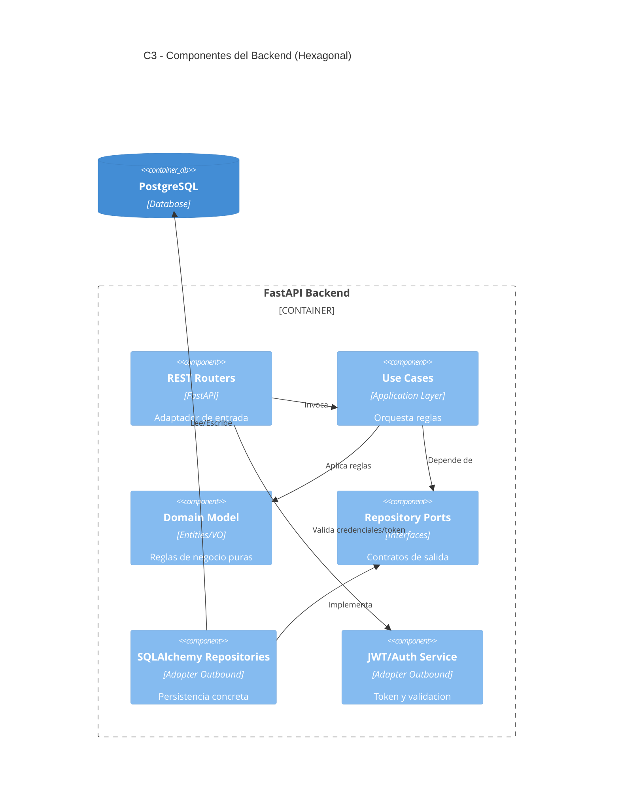

# C4 Componentes Backend (C3) - Ideas Tracker

```mermaid
C4Component
title C3 - Componentes del Backend (Hexagonal)
Container_Boundary(api, "FastAPI Backend") {
  Component(rest, "REST Routers", "FastAPI", "Adaptador de entrada")
  Component(usecases, "Use Cases", "Application Layer", "Orquesta reglas")
  Component(domain, "Domain Model", "Entities/VO", "Reglas de negocio puras")
  Component(repoports, "Repository Ports", "Interfaces", "Contratos de salida")
  Component(sqlrepo, "SQLAlchemy Repositories", "Adapter Outbound", "Persistencia concreta")
  Component(auth, "JWT/Auth Service", "Adapter Outbound", "Token y validacion")
}
ContainerDb(db, "PostgreSQL", "Database")

Rel(rest, usecases, "Invoca")
Rel(usecases, domain, "Aplica reglas")
Rel(usecases, repoports, "Depende de")
Rel(sqlrepo, repoports, "Implementa")
Rel(sqlrepo, db, "Lee/Escribe")
Rel(rest, auth, "Valida credenciales/token")
```
