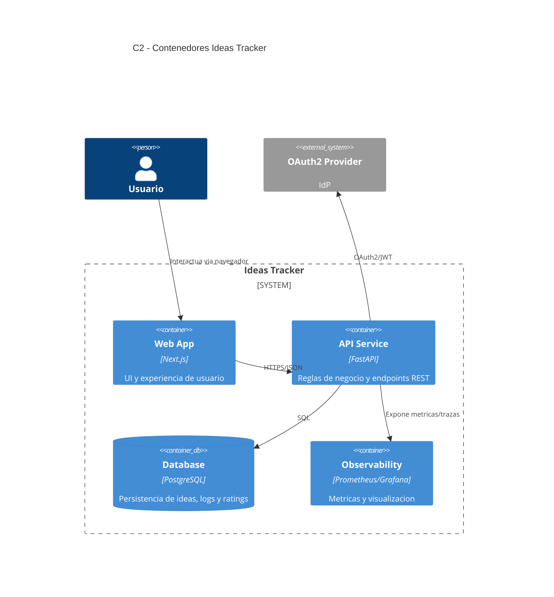

# C4 Contenedores (C2) - Ideas Tracker

```mermaid
C4Container
title C2 - Contenedores Ideas Tracker
Person(user, "Usuario")
System_Boundary(boundary, "Ideas Tracker") {
  Container(web, "Web App", "Next.js", "UI y experiencia de usuario")
  Container(api, "API Service", "FastAPI", "Reglas de negocio y endpoints REST")
  ContainerDb(db, "Database", "PostgreSQL", "Persistencia de ideas, logs y ratings")
  Container(obs, "Observability", "Prometheus/Grafana", "Metricas y visualizacion")
}
System_Ext(idp, "OAuth2 Provider", "IdP")

Rel(user, web, "Interactua via navegador")
Rel(web, api, "HTTPS/JSON")
Rel(api, db, "SQL")
Rel(api, idp, "OAuth2/JWT")
Rel(api, obs, "Expone metricas/trazas")
```
