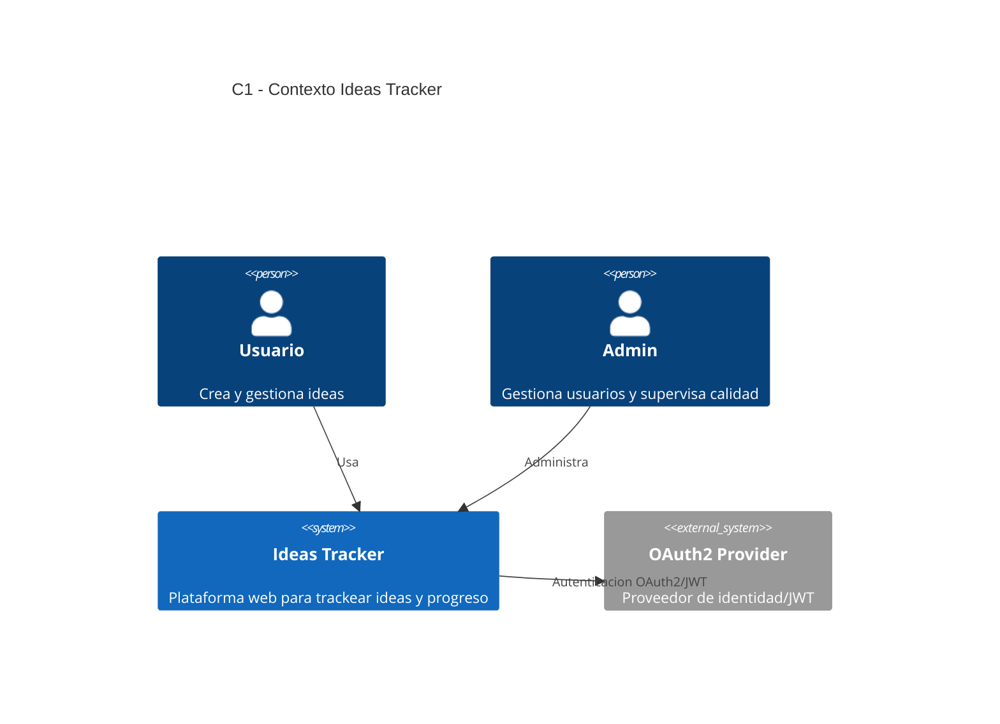

# C4 Contexto (C1) - Ideas Tracker

```mermaid
C4Context
title C1 - Contexto Ideas Tracker
Person(user, "Usuario", "Crea y gestiona ideas")
Person(admin, "Admin", "Gestiona usuarios y supervisa calidad")
System(system, "Ideas Tracker", "Plataforma web para trackear ideas y progreso")
System_Ext(idp, "OAuth2 Provider", "Proveedor de identidad/JWT")

Rel(user, system, "Usa")
Rel(admin, system, "Administra")
Rel(system, idp, "Autenticacion OAuth2/JWT")
```
