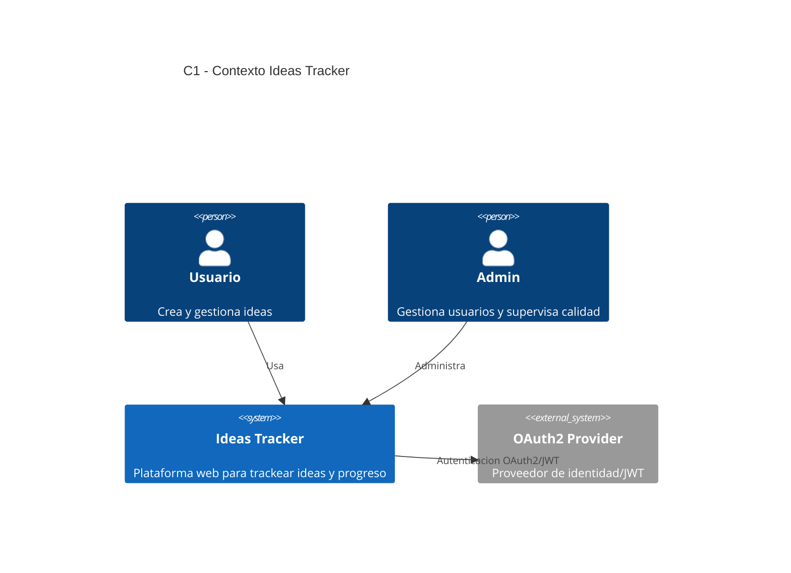
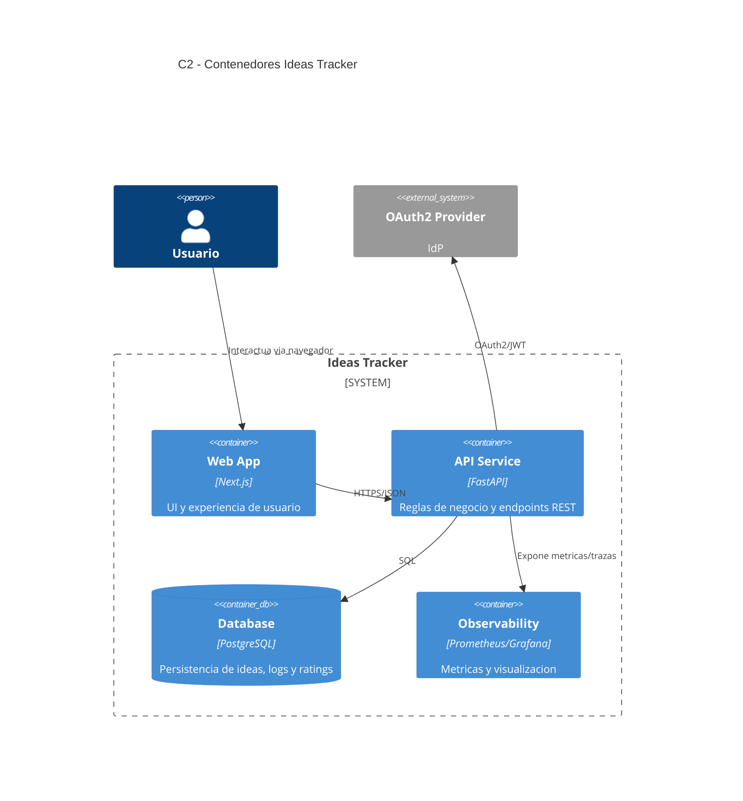
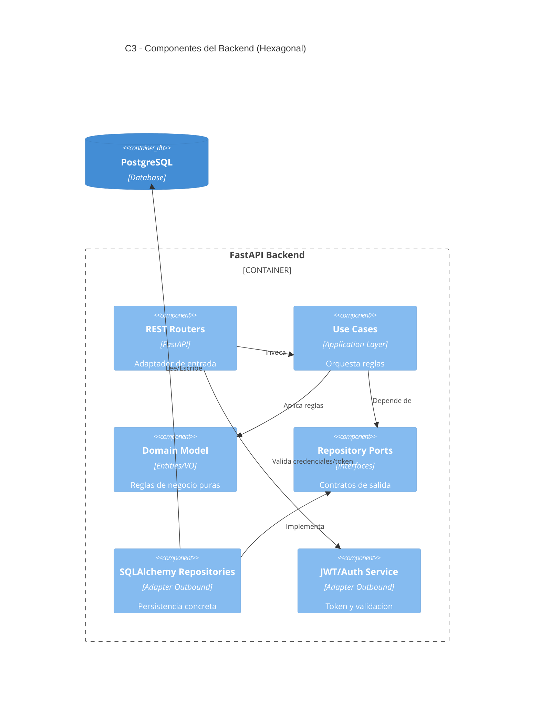

# Fase 1 - Base de Arquitectura y Repositorio (Tickets + Pasos + Comandos)

## 1. Objetivo de la fase

Dejar una base tecnica ejecutable para comenzar desarrollo funcional en Fase 2/Fase 3, con estructura de proyecto, bootstrap de backend/frontend y arquitectura hexagonal inicial.

## 1.1 Fuentes base

- `diseno-sistema-ideas.md`
- `diseno-sistema-ideas-backlog.md`
- `diseno-sistema-ideas-escenarios.md`

---

## 2. Orden de ejecucion recomendado (Fase 1)

1. `F1-01` Estructura monorepo.
2. `F1-02` Bootstrap FastAPI + uv.
3. `F1-03` Bootstrap Next.js.
4. `F1-04` Base hexagonal backend.
5. `F1-05` Variables de entorno y configuracion.
6. `F1-06` C4 C1/C2 inicial.

---

## 3. Tickets de Fase 1 (detalle paso a paso)

## Ticket F1-01 - Crear estructura monorepo

- Tipo: `TASK`
- Prioridad: `P0`
- Estimacion: `2 pts`
- Dependencias: ninguna

### Paso a paso

1. Crear estructura de carpetas base.
2. Agregar README de cada modulo.
3. Agregar `.gitignore` raiz.
4. Definir estructura inicial de `docs`.

### Comandos (PowerShell)

```powershell
mkdir backend, frontend, infra, docs
mkdir docs\architecture, docs\decisions
New-Item -ItemType File -Path .gitignore -Force
New-Item -ItemType File -Path README.md -Force
New-Item -ItemType File -Path backend\README.md -Force
New-Item -ItemType File -Path frontend\README.md -Force
New-Item -ItemType File -Path infra\README.md -Force
```

### Criterios de aceptacion

- Estructura base creada y versionable.
- Carpetas principales listas para bootstrap.

---

## Ticket F1-02 - Bootstrap FastAPI + uv

- Tipo: `TASK`
- Prioridad: `P0`
- Estimacion: `3 pts`
- Dependencias: `F1-01`

### Paso a paso

1. Inicializar proyecto Python en `backend`.
2. Instalar dependencias minimas de API.
3. Crear `main.py` con endpoint `GET /health`.
4. Verificar arranque local.

### Comandos (PowerShell)

```powershell
cd backend
uv init
uv add fastapi "uvicorn[standard]" pydantic-settings
uv add sqlalchemy alembic psycopg[binary]
uv add python-jose[cryptography] passlib[bcrypt]
mkdir src
New-Item -ItemType File -Path src\main.py -Force
uv run uvicorn src.main:app --reload --port 8000
```

### `src/main.py` minimo esperado

```python
from fastapi import FastAPI

app = FastAPI(title="Ideas Tracker API")


@app.get("/health")
def health() -> dict[str, str]:
    return {"status": "ok"}
```

### Criterios de aceptacion

- API responde `200` en `/health`.
- Dependencias base instaladas con `uv`.

---

## Ticket F1-03 - Bootstrap Next.js (App Router)

- Tipo: `TASK`
- Prioridad: `P0`
- Estimacion: `3 pts`
- Dependencias: `F1-01`

### Paso a paso

1. Inicializar app Next.js con TypeScript.
2. Confirmar que levanta en local.
3. Crear pagina inicial de estado.

### Comandos (PowerShell)

```powershell
cd ..
npx create-next-app@latest frontend --ts --eslint --app --src-dir --import-alias "@/*" --use-npm
cd frontend
npm run dev
```

### Criterios de aceptacion

- Frontend inicia correctamente en local.
- Estructura App Router disponible.

---

## Ticket F1-04 - Definir arquitectura hexagonal base en backend

- Tipo: `TASK`
- Prioridad: `P0`
- Estimacion: `5 pts`
- Dependencias: `F1-02`

### Paso a paso

1. Crear capas: `domain`, `application`, `adapters`, `bootstrap`.
2. Definir puertos iniciales de repositorio/seguridad.
3. Implementar un caso de uso de ejemplo (`CreateIdea` stub).
4. Exponer endpoint REST conectado al caso de uso (stub).
5. Verificar separacion de dependencias hacia adentro.

### Comandos (PowerShell)

```powershell
cd ..\backend
mkdir src\app\domain\idea
mkdir src\app\application\idea\use_cases
mkdir src\app\application\idea
mkdir src\app\adapters\inbound\rest\routers
mkdir src\app\adapters\outbound\persistence\sqlalchemy\repositories
mkdir src\app\bootstrap

New-Item -ItemType File -Path src\app\application\idea\ports.py -Force
New-Item -ItemType File -Path src\app\application\idea\dto.py -Force
New-Item -ItemType File -Path src\app\application\idea\use_cases\create_idea.py -Force
New-Item -ItemType File -Path src\app\adapters\inbound\rest\routers\ideas_router.py -Force
```

### Criterios de aceptacion

- Estructura hexagonal inicial creada.
- Existe un flujo REST -> UseCase sin acoplar dominio a FastAPI/ORM.

---

## Ticket F1-05 - Configurar variables de entorno por entorno

- Tipo: `TASK`
- Prioridad: `P1`
- Estimacion: `2 pts`
- Dependencias: `F1-02`, `F1-03`

### Paso a paso

1. Definir `.env.example` en backend y frontend.
2. Definir clases de settings (backend).
3. Definir variables de API URL (frontend).
4. Verificar carga de variables en desarrollo.

### Comandos (PowerShell)

```powershell
cd ..\backend
New-Item -ItemType File -Path .env.example -Force
New-Item -ItemType File -Path src\app\bootstrap\settings.py -Force

cd ..\frontend
New-Item -ItemType File -Path .env.example -Force
```

### Variables sugeridas

- Backend:
  - `APP_ENV`
  - `APP_PORT`
  - `DATABASE_URL`
  - `JWT_SECRET_KEY`
  - `JWT_ALGORITHM`
  - `JWT_EXPIRE_MINUTES`
- Frontend:
  - `NEXT_PUBLIC_API_BASE_URL`

### Criterios de aceptacion

- Existe `.env.example` en ambos modulos.
- La app puede levantar con variables minimas definidas.

---

## Ticket F1-06 - Crear diagramas C4 iniciales (Mermaid)

- Tipo: `TASK`
- Prioridad: `P2`
- Estimacion: `2 pts`
- Dependencias: `F1-01`

### Paso a paso

1. Definir C4 nivel Contexto (C1).
2. Definir C4 nivel Contenedores (C2).
3. Definir C4 nivel Componentes del backend (C3).
4. Publicar diagramas en `docs` y referenciarlos en documento principal.

### Comandos (PowerShell)

```powershell
cd ..
New-Item -ItemType File -Path docs\architecture\c4-contexto.md -Force
New-Item -ItemType File -Path docs\architecture\c4-contenedores.md -Force
New-Item -ItemType File -Path docs\architecture\c4-componentes-backend.md -Force
```

### Diagrama C4 - Contexto (C1, Mermaid)



### Diagrama C4 - Contenedores (C2, Mermaid)



### Diagrama C4 - Componentes Backend (C3, Mermaid)



### Criterios de aceptacion

- Existen diagramas C4 C1/C2/C3 en Mermaid.
- Son consistentes con la arquitectura hexagonal y stack definido.

---

## 4. Checklist de cierre de Fase 1

- `F1-01` Estructura base creada.
- `F1-02` Backend FastAPI operativo (`/health`).
- `F1-03` Frontend Next.js operativo.
- `F1-04` Base hexagonal inicial creada.
- `F1-05` Configuracion por entorno lista.
- `F1-06` Diagramas C4 publicados.

---

## 5. Definition of Done (DoD) Fase 1

La Fase 1 se considera cerrada cuando:
- El repositorio tiene base ejecutable de backend y frontend.
- La arquitectura hexagonal esta representada en estructura de carpetas y flujo inicial.
- Configuracion por entorno esta documentada.
- Diagramas C4 en Mermaid estan versionados y revisados.
- Todo listo para iniciar Fase 2 (modelo de datos y persistencia).
