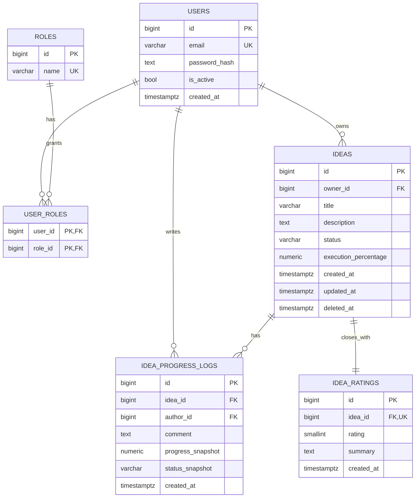

# Fase 2 - Modelo de Datos y Persistencia (Tickets + Pasos + Comandos)

## 1. Objetivo de la fase

Implementar la base de persistencia del sistema usando PostgreSQL, SQLAlchemy 2.x y Alembic, dejando un esquema relacional normalizado, migraciones versionadas y datos semilla iniciales.

## 1.1 Fuentes base

- `diseno-sistema-ideas.md`
- `diseno-sistema-ideas-backlog.md`
- `diseno-sistema-ideas-escenarios.md`
- `diseno-sistema-ideas-fase-1.md`

---

## 2. Orden de ejecucion recomendado (Fase 2)

1. `F2-01` Configurar SQLAlchemy 2.x y session management.
2. `F2-02` Configurar Alembic y estrategia de migraciones.
3. `F2-03` Modelar `users`, `roles`, `user_roles`.
4. `F2-04` Modelar `ideas`, `idea_progress_logs`, `idea_ratings`.
5. `F2-05` Definir indices y constraints de alto impacto.
6. `F2-06` Crear seeds iniciales.

---

## 3. Tickets de Fase 2 (detalle paso a paso)

## Ticket F2-01 - Configurar SQLAlchemy 2.x y session management

- Tipo: `TASK`
- Prioridad: `P0`
- Estimacion: `3 pts`
- Dependencias: `F1-02`, `F1-04`, `F1-05`

### Objetivo

Tener una configuracion robusta de conexion y manejo de sesiones para los repositorios outbound.

### Paso a paso

1. Verificar dependencias Python instaladas:
   - `sqlalchemy`
   - `psycopg[binary]`
2. Crear modulo de base de datos:
   - `engine`
   - `SessionLocal`
   - `Base`
3. Leer `DATABASE_URL` desde settings.
4. Crear dependencia para inyectar sesion en adaptadores REST/repositories.
5. Validar conexion a DB con script de prueba.

### Comandos (PowerShell)

```powershell
cd backend
uv add sqlalchemy psycopg[binary]
mkdir src\app\adapters\outbound\persistence\sqlalchemy
New-Item -ItemType File -Path src\app\adapters\outbound\persistence\sqlalchemy\session.py -Force
New-Item -ItemType File -Path src\app\adapters\outbound\persistence\sqlalchemy\base.py -Force
```

### Archivos esperados

- `src/app/adapters/outbound/persistence/sqlalchemy/base.py`
- `src/app/adapters/outbound/persistence/sqlalchemy/session.py`
- `src/app/bootstrap/settings.py` (actualizado con `DATABASE_URL`)

### Criterios de aceptacion

- Conexion a Postgres funcional.
- Sesion por request disponible para repositorios.
- Configuracion compatible con tests.

---

## Ticket F2-02 - Configurar Alembic y estrategia de migraciones

- Tipo: `TASK`
- Prioridad: `P0`
- Estimacion: `3 pts`
- Dependencias: `F2-01`

### Objetivo

Versionar cambios de esquema y habilitar despliegue reproducible de base de datos.

### Paso a paso

1. Inicializar Alembic en backend.
2. Configurar `alembic.ini` y `env.py` para usar `DATABASE_URL`.
3. Conectar metadata de SQLAlchemy (Base metadata).
4. Definir convencion de nombrado para constraints (recomendado).
5. Crear migracion inicial vacia para validar pipeline.
6. Ejecutar `upgrade head` en local.

### Comandos (PowerShell)

```powershell
cd backend
uv add alembic
uv run alembic init migrations
uv run alembic revision -m "init schema"
uv run alembic upgrade head
```

### Convenciones recomendadas de migracion

- Un cambio logico = una migracion.
- Mensaje de migracion descriptivo y corto.
- No editar migraciones ya aplicadas en entornos compartidos.

### Criterios de aceptacion

- Alembic inicializado y conectado a metadata real.
- `upgrade head` ejecuta sin errores.

---

## Ticket F2-03 - Modelar `users`, `roles`, `user_roles`

- Tipo: `STORY`
- Prioridad: `P0`
- Estimacion: `3 pts`
- Dependencias: `F2-02`

### Objetivo

Crear el modelo base de identidad y autorizacion para soportar login y roles.

### Paso a paso

1. Crear modelos ORM:
   - `User`
   - `Role`
   - tabla puente `user_roles`
2. Definir constraints:
   - `users.email` unico
   - `roles.name` unico
   - PK compuesta en `user_roles`.
3. Definir relaciones ORM bidireccionales.
4. Generar migracion para estas tablas.
5. Ejecutar migracion y validar estructura.

### Comandos (PowerShell)

```powershell
cd backend
New-Item -ItemType File -Path src\app\adapters\outbound\persistence\sqlalchemy\models_auth.py -Force
uv run alembic revision --autogenerate -m "add users roles user_roles"
uv run alembic upgrade head
```

### Criterios de aceptacion

- Tablas de auth creadas con constraints correctos.
- Relaciones ORM funcionando en pruebas simples.

---

## Ticket F2-04 - Modelar `ideas`, `idea_progress_logs`, `idea_ratings`

- Tipo: `STORY`
- Prioridad: `P0`
- Estimacion: `5 pts`
- Dependencias: `F2-02`, `F2-03`

### Objetivo

Persistir el dominio principal del producto con reglas de consistencia a nivel DB.

### Paso a paso

1. Crear modelo `Idea` con:
   - `status` (`idea`, `in_progress`, `terminada`)
   - `execution_percentage` (0 a 100)
   - timestamps y soft delete.
2. Crear `IdeaProgressLog` con snapshots de estado/progreso.
3. Crear `IdeaRating` con relacion 1:1 por idea.
4. Agregar checks de rango/valores.
5. Generar y ejecutar migracion.
6. Validar consultas basicas (insert, select, joins).

### Comandos (PowerShell)

```powershell
cd backend
New-Item -ItemType File -Path src\app\adapters\outbound\persistence\sqlalchemy\models_idea.py -Force
uv run alembic revision --autogenerate -m "add ideas logs ratings"
uv run alembic upgrade head
```

### Criterios de aceptacion

- Tablas de dominio creadas en DB.
- Checks de porcentaje/rating activos.
- Relacion 1:N idea->logs y 1:1 idea->rating implementadas.

---

## Ticket F2-05 - Definir indices y constraints de alto impacto

- Tipo: `TASK`
- Prioridad: `P1`
- Estimacion: `2 pts`
- Dependencias: `F2-03`, `F2-04`

### Objetivo

Optimizar consultas mas frecuentes y reforzar consistencia de datos.

### Paso a paso

1. Identificar patrones de consulta esperados:
   - listar ideas por owner/estado/fecha.
   - listar logs por `idea_id` y fecha.
2. Definir indices:
   - `ideas(owner_id, status, created_at)`
   - `idea_progress_logs(idea_id, created_at)`
3. Revisar constraints criticos:
   - unique de rating por idea,
   - checks de rango.
4. Crear migracion de optimizacion.
5. Validar plan de consulta basico (si aplica).

### Comandos (PowerShell)

```powershell
cd backend
uv run alembic revision -m "add indexes and constraints optimization"
uv run alembic upgrade head
```

### Criterios de aceptacion

- Indices aplicados y versionados.
- Constraints criticos verificables en DB.

---

## Ticket F2-06 - Crear seed inicial (roles, admin y data minima)

- Tipo: `TASK`
- Prioridad: `P2`
- Estimacion: `2 pts`
- Dependencias: `F2-03`, `F2-04`

### Objetivo

Facilitar arranque local/QA con datos iniciales consistentes.

### Paso a paso

1. Crear script de seed idempotente.
2. Insertar roles base (`admin`, `user`).
3. Insertar usuario admin inicial.
4. (Opcional) Insertar una idea demo y logs demo.
5. Ejecutar seed y validar.

### Comandos (PowerShell)

```powershell
cd backend
mkdir scripts
New-Item -ItemType File -Path scripts\seed.py -Force
uv run python scripts\seed.py
```

### Criterios de aceptacion

- Script seed ejecuta sin duplicar registros criticos.
- Entorno local queda listo para auth y pruebas iniciales.

---

## 4. Diagrama relacional normalizado (Mermaid)



---

## 5. Trazabilidad Fase 2 (ticket -> escenarios)

| Ticket | Escenarios impactados | Tipo de validacion |
|---|---|---|
| F2-03 | SCN-AUTH-001, SCN-AUTH-002, SCN-AUTH-005 | Integracion API auth |
| F2-04 | SCN-IDEA-001..006, SCN-PROG-001..004, SCN-LOG-001..004, SCN-RATE-001..004 | Unit dominio + Integracion API |
| F2-05 | SCN-IDEA-003, SCN-LOG-003 | Rendimiento consulta + Integracion |
| F2-06 | SCN-E2E-001 (precondiciones), SCN-AUTH-001 | Smoke local + E2E base |

---

## 6. Checklist de cierre de Fase 2

- `F2-01` Session management operativo.
- `F2-02` Alembic operativo con `upgrade head`.
- `F2-03` Tablas de auth listas.
- `F2-04` Tablas de dominio listas.
- `F2-05` Indices y constraints aplicados.
- `F2-06` Seed idempotente operativo.

---

## 7. Definition of Done (DoD) Fase 2

La Fase 2 se considera cerrada cuando:
- El esquema de BD esta normalizado y versionado en migraciones.
- Las tablas y relaciones soportan todos los escenarios `@mvp`.
- Los checks de negocio base existen en DB (porcentaje, rating, estado).
- El entorno local se inicializa de manera reproducible (migrate + seed).
- Esta lista la base para implementar auth y casos de uso en Fase 3/Fase 4.
