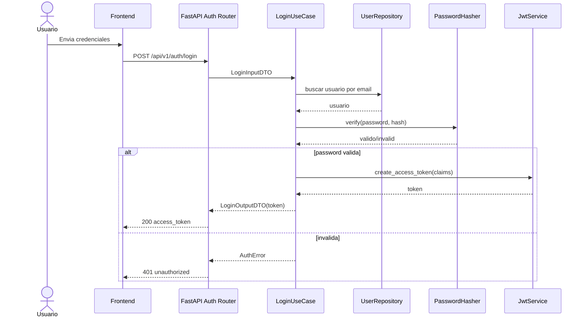

# Fase 3 - Seguridad y Autenticacion (Tickets + Pasos + Comandos)

## 1. Objetivo de la fase

Implementar autenticacion y autorizacion base del sistema con OAuth2 + JWT, protegiendo endpoints y estableciendo controles minimos de seguridad para el MVP.

## 1.1 Fuentes base

- `diseno-sistema-ideas.md`
- `diseno-sistema-ideas-backlog.md`
- `diseno-sistema-ideas-escenarios.md`
- `diseno-sistema-ideas-fase-2.md`

---

## 2. Orden de ejecucion recomendado (Fase 3)

1. `F3-01` Implementar login con OAuth2/JWT.
2. `F3-02` Implementar hash/verify de password.
3. `F3-03` Implementar autorizacion por rol.
4. `F3-05` Endurecer seguridad (rate limiting + headers).
5. `F3-04` Implementar refresh token (opcional para MVP).

---

## 3. Tickets de Fase 3 (detalle paso a paso)

## Ticket F3-01 - Implementar login con OAuth2/JWT

- Tipo: `STORY`
- Prioridad: `P0`
- Estimacion: `5 pts`
- Dependencias: `F2-03`, `F2-06`

### Objetivo

Exponer endpoint de login que valide credenciales y emita `access_token` JWT para consumir API protegida.

### Paso a paso

1. Definir `TokenServicePort` (aplicacion) y adapter JWT (outbound).
2. Implementar caso de uso `LoginUseCase`.
3. Crear endpoint `POST /api/v1/auth/login`.
4. Validar credenciales contra `users` persistidos.
5. Emitir token con claims minimos:
   - `sub` (id usuario)
   - `email`
   - `roles`
   - `exp`, `iat`
6. Estandarizar errores de auth (`401`).

### Comandos (PowerShell)

```powershell
cd backend
uv add python-jose[cryptography]
mkdir src\app\application\auth\use_cases
mkdir src\app\adapters\inbound\rest\routers
mkdir src\app\adapters\outbound\security
New-Item -ItemType File -Path src\app\application\auth\ports.py -Force
New-Item -ItemType File -Path src\app\application\auth\dto.py -Force
New-Item -ItemType File -Path src\app\application\auth\use_cases\login.py -Force
New-Item -ItemType File -Path src\app\adapters\outbound\security\jwt_service.py -Force
New-Item -ItemType File -Path src\app\adapters\inbound\rest\routers\auth_router.py -Force
```

### Criterios de aceptacion

- `POST /api/v1/auth/login` responde `200` con `access_token` valido.
- Credenciales invalidas responden `401`.
- Token incluye claims requeridos.

---

## Ticket F3-02 - Implementar hash/verify de password

- Tipo: `TASK`
- Prioridad: `P0`
- Estimacion: `2 pts`
- Dependencias: `F3-01`

### Objetivo

Garantizar que password no se almacene ni compare en texto plano.

### Paso a paso

1. Definir `PasswordHasherPort`.
2. Implementar adapter con `passlib[bcrypt]` o Argon2.
3. Integrar `verify` en login.
4. Crear utilidad para alta de usuario semilla con hash.
5. Probar hash/verify unitariamente.

### Comandos (PowerShell)

```powershell
cd backend
uv add passlib[bcrypt]
New-Item -ItemType File -Path src\app\adapters\outbound\security\password_hasher.py -Force
```

### Criterios de aceptacion

- Password persistido en hash.
- Login valida password solo via `verify`.

---

## Ticket F3-03 - Implementar autorizacion por rol

- Tipo: `TASK`
- Prioridad: `P1`
- Estimacion: `3 pts`
- Dependencias: `F3-01`, `F2-03`

### Objetivo

Restringir endpoints por rol para proteger operaciones sensibles.

### Paso a paso

1. Agregar dependencia `get_current_user` desde JWT.
2. Implementar guard `require_roles(...)`.
3. Definir politica minima:
   - `user`: operaciones propias.
   - `admin`: operaciones globales/administrativas.
4. Aplicar guards en routers.
5. Cubrir respuestas `403`.

### Comandos (PowerShell)

```powershell
cd backend
New-Item -ItemType File -Path src\app\adapters\inbound\rest\auth_dependencies.py -Force
```

### Criterios de aceptacion

- Endpoint protegido responde `403` si rol no permitido.
- Rol correcto permite acceso esperado.

---

## Ticket F3-05 - Endurecer seguridad (rate limiting + headers)

- Tipo: `TASK`
- Prioridad: `P1`
- Estimacion: `3 pts`
- Dependencias: `F3-01`

### Objetivo

Reducir riesgo de abuso en login y fortalecer superficie HTTP.

### Paso a paso

1. Implementar rate limit en `/auth/login`.
2. Definir politicas iniciales (ejemplo: 5 intentos/min por IP/usuario).
3. Agregar headers de seguridad HTTP.
4. Registrar eventos de auth fallida en logs estructurados.
5. Validar respuesta `429` cuando excede limite.

### Comandos (PowerShell)

```powershell
cd backend
uv add slowapi
```

### Criterios de aceptacion

- Exceso de intentos responde `429`.
- Headers de seguridad aplicados en respuestas.

---

## Ticket F3-04 - Implementar refresh token (opcional MVP)

- Tipo: `TASK`
- Prioridad: `P2`
- Estimacion: `3 pts`
- Dependencias: `F3-01`

### Objetivo

Permitir renovacion de sesion sin reingresar credenciales en cada expiracion de access token.

### Paso a paso

1. Diseñar estrategia refresh:
   - token rotativo recomendado,
   - TTL separado de access token.
2. Crear endpoint `POST /api/v1/auth/refresh`.
3. Implementar invalidacion/rotacion basica.
4. Definir almacenamiento:
   - DB (recomendado para control),
   - o cookie HttpOnly si aplicas flujo web.
5. Agregar pruebas de expiracion y reuse.

### Comandos (PowerShell)

```powershell
cd backend
New-Item -ItemType File -Path src\app\application\auth\use_cases\refresh_token.py -Force
```

### Criterios de aceptacion

- Refresh emite nuevo `access_token` valido.
- Refresh invalido/expirado responde `401`.

---

## 4. Variables de entorno de seguridad (backend)

Agregar o validar en `.env.example`:

- `JWT_SECRET_KEY=change_me`
- `JWT_ALGORITHM=HS256`
- `JWT_EXPIRE_MINUTES=30`
- `JWT_REFRESH_EXPIRE_MINUTES=10080`
- `AUTH_RATE_LIMIT_LOGIN=5/minute`

---

## 5. Flujo de autenticacion (Mermaid)



---

## 6. Trazabilidad Fase 3 (ticket -> escenarios)

| Ticket | Escenarios impactados | Tipo de validacion |
|---|---|---|
| F3-01 | SCN-AUTH-001, SCN-AUTH-002, SCN-AUTH-003, SCN-AUTH-004 | Integracion API + Unit auth |
| F3-02 | SCN-AUTH-001, SCN-AUTH-002 | Unit seguridad + Integracion API |
| F3-03 | SCN-AUTH-005 | Integracion API |
| F3-05 | SCN-SEC-002, SCN-SEC-003 | Integracion API + pruebas de abuso |
| F3-04 | (extension) flujo auth de sesion prolongada | Integracion API |

---

## 7. Plan de pruebas de la fase

### Unitarias (pytest)

- `JwtService`:
  - crea token con claims esperados.
  - detecta token expirado/invalido.
- `PasswordHasher`:
  - hash != password original.
  - verify true/false segun password.
- `LoginUseCase`:
  - retorna token en caso feliz.
  - lanza error en email/password invalidos.

### Integracion API

- Login exitoso/fallido.
- Acceso sin token (`401`).
- Acceso con token expirado (`401`).
- Acceso con rol insuficiente (`403`).
- Rate limit en login (`429`).

---

## 8. Checklist de cierre de Fase 3

- `F3-01` Login JWT funcional.
- `F3-02` Hash/verify de password activo.
- `F3-03` Guards por rol aplicados.
- `F3-05` Rate limiting y headers activos.
- `F3-04` implementado o diferido explicitamente.

---

## 9. Definition of Done (DoD) Fase 3

La Fase 3 se considera cerrada cuando:
- Los endpoints sensibles requieren autenticacion JWT.
- Existen controles de autorizacion por rol donde corresponda.
- El login esta protegido contra abuso basico (rate limiting).
- Las pruebas de escenarios de auth/seguridad clave estan en verde.
- El sistema queda listo para implementar API de dominio (Fase 4).
