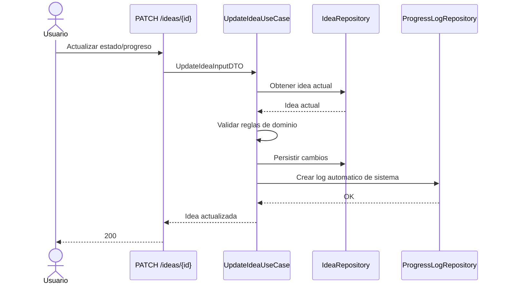

# Fase 4 - API de Dominio (Ideas, Logs, Rating) (Tickets + Pasos + Comandos)

## 1. Objetivo de la fase

Implementar el nucleo funcional del producto: CRUD de ideas, actualizacion de estado/progreso, historial de comentarios (traza) y calificacion final del proyecto, todo con reglas de negocio consistentes.

## 1.1 Fuentes base

- `diseno-sistema-ideas.md`
- `diseno-sistema-ideas-backlog.md`
- `diseno-sistema-ideas-escenarios.md`
- `diseno-sistema-ideas-fase-2.md`
- `diseno-sistema-ideas-fase-3.md`

---

## 2. Orden de ejecucion recomendado (Fase 4)

1. `F4-01` Crear idea.
2. `F4-02` Listar ideas.
3. `F4-03` Ver detalle de idea.
4. `F4-04` Actualizar idea (estado/progreso con validaciones).
5. `F4-06` Crear log de progreso.
6. `F4-07` Listar logs de progreso.
7. `F4-09` Log automatico por cambio de estado/progreso.
8. `F4-08` Crear/editar rating final.
9. `F4-05` Eliminar idea con borrado logico.

---

## 3. Contrato de API v1 para esta fase

Base: `/api/v1`

- Ideas:
  - `POST /ideas`
  - `GET /ideas`
  - `GET /ideas/{idea_id}`
  - `PATCH /ideas/{idea_id}`
  - `DELETE /ideas/{idea_id}`
- Logs:
  - `POST /ideas/{idea_id}/logs`
  - `GET /ideas/{idea_id}/logs`
- Rating:
  - `POST /ideas/{idea_id}/rating`
  - `PATCH /ideas/{idea_id}/rating`
  - `GET /ideas/{idea_id}/rating`

---

## 4. Reglas de negocio obligatorias

1. `execution_percentage` en rango `0..100`.
2. Estado permitido: `idea`, `in_progress`, `terminada`.
3. Para estado `terminada`, `execution_percentage` debe ser `100`.
4. Rating solo si la idea esta en estado `terminada`.
5. Rating en rango `1..10`.
6. Cada cambio relevante de estado/progreso debe dejar traza en logs.
7. `DELETE` es borrado logico (`deleted_at`), no fisico.

---

## 5. Tickets de Fase 4 (detalle paso a paso)

## Ticket F4-01 - Crear idea (`POST /ideas`)

- Tipo: `STORY`
- Prioridad: `P0`
- Estimacion: `3 pts`
- Dependencias: `F3-01`, `F2-04`

### Objetivo

Permitir crear una idea asociada al usuario autenticado.

### Paso a paso

1. Definir DTO `CreateIdeaInput` y `IdeaOutput`.
2. Implementar `CreateIdeaUseCase`.
3. Implementar `IdeaRepositoryPort.create(...)`.
4. Implementar adapter SQLAlchemy para `create`.
5. Crear router `POST /ideas`.
6. Forzar valores iniciales:
   - estado `idea`
   - progreso `0`.
7. Probar caso feliz y validaciones.

### Comandos (PowerShell)

```powershell
cd backend
New-Item -ItemType File -Path src\app\application\idea\use_cases\create_idea.py -Force
New-Item -ItemType File -Path src\app\adapters\inbound\rest\routers\ideas_router.py -Force
```

### Criterios de aceptacion

- `POST /ideas` responde `201`.
- Idea creada con owner del token.
- Estado/progreso iniciales correctos.

---

## Ticket F4-02 - Listar ideas (`GET /ideas`)

- Tipo: `STORY`
- Prioridad: `P0`
- Estimacion: `2 pts`
- Dependencias: `F4-01`

### Objetivo

Mostrar listado de ideas activas del usuario (y/o alcance segun rol).

### Paso a paso

1. Definir caso de uso `ListIdeasUseCase`.
2. Agregar filtros basicos:
   - `status` opcional
   - paginacion (`limit`, `offset`)
3. Excluir registros con `deleted_at` no nulo.
4. Implementar endpoint `GET /ideas`.
5. Validar ordenamiento por fecha de creacion descendente.

### Comandos (PowerShell)

```powershell
cd backend
New-Item -ItemType File -Path src\app\application\idea\use_cases\list_ideas.py -Force
```

### Criterios de aceptacion

- `GET /ideas` responde `200`.
- No devuelve ideas borradas logicamente.

---

## Ticket F4-03 - Ver detalle de idea (`GET /ideas/{id}`)

- Tipo: `STORY`
- Prioridad: `P0`
- Estimacion: `2 pts`
- Dependencias: `F4-01`

### Objetivo

Consultar una idea puntual respetando permisos.

### Paso a paso

1. Implementar `GetIdeaDetailUseCase`.
2. Buscar por id y validar ownership/rol.
3. Devolver `404` si no existe o esta eliminada.
4. Publicar endpoint `GET /ideas/{idea_id}`.

### Comandos (PowerShell)

```powershell
cd backend
New-Item -ItemType File -Path src\app\application\idea\use_cases\get_idea_detail.py -Force
```

### Criterios de aceptacion

- Retorna `200` con payload correcto para id valido.
- Retorna `404` para id inexistente/no visible.

---

## Ticket F4-04 - Actualizar idea (`PATCH /ideas/{id}`)

- Tipo: `STORY`
- Prioridad: `P0`
- Estimacion: `5 pts`
- Dependencias: `F4-01`

### Objetivo

Actualizar estado, progreso y metadatos con validaciones estrictas de dominio.

### Paso a paso

1. Definir `UpdateIdeaUseCase`.
2. Permitir patch parcial de campos autorizados.
3. Aplicar reglas:
   - porcentaje dentro de rango,
   - `terminada` exige `100`.
4. Validar transiciones invalidas de estado.
5. Persistir `updated_at`.
6. Devolver errores de negocio con codigo consistente (`400`/`422`).

### Comandos (PowerShell)

```powershell
cd backend
New-Item -ItemType File -Path src\app\application\idea\use_cases\update_idea.py -Force
```

### Criterios de aceptacion

- `PATCH` aplica cambios validos y rechaza invalidos.
- Reglas de estado/progreso se cumplen en todos los casos.

---

## Ticket F4-05 - Eliminar idea (soft delete)

- Tipo: `STORY`
- Prioridad: `P1`
- Estimacion: `3 pts`
- Dependencias: `F4-01`

### Objetivo

Eliminar una idea sin perder historico, usando borrado logico.

### Paso a paso

1. Implementar `DeleteIdeaUseCase`.
2. Marcar `deleted_at = now()` en vez de `DELETE` fisico.
3. Excluir registros borrados de listados y detalle.
4. Implementar endpoint `DELETE /ideas/{idea_id}`.

### Comandos (PowerShell)

```powershell
cd backend
New-Item -ItemType File -Path src\app\application\idea\use_cases\delete_idea.py -Force
```

### Criterios de aceptacion

- Endpoint responde `204`.
- Idea no aparece en `GET /ideas` ni detalle.

---

## Ticket F4-06 - Crear log de progreso (`POST /ideas/{id}/logs`)

- Tipo: `STORY`
- Prioridad: `P0`
- Estimacion: `3 pts`
- Dependencias: `F4-01`

### Objetivo

Registrar comentarios de avance con snapshot de estado y progreso.

### Paso a paso

1. Definir DTO para comentario.
2. Implementar `AddProgressLogUseCase`.
3. Validar comentario no vacio.
4. Capturar `status_snapshot` y `progress_snapshot`.
5. Persistir log con `author_id`.
6. Exponer endpoint `POST /ideas/{id}/logs`.

### Comandos (PowerShell)

```powershell
cd backend
New-Item -ItemType File -Path src\app\application\idea\use_cases\add_progress_log.py -Force
New-Item -ItemType File -Path src\app\adapters\inbound\rest\routers\logs_router.py -Force
```

### Criterios de aceptacion

- Comentario valido crea log (`201`).
- Comentario vacio retorna `422`.

---

## Ticket F4-07 - Listar logs de progreso (`GET /ideas/{id}/logs`)

- Tipo: `STORY`
- Prioridad: `P1`
- Estimacion: `2 pts`
- Dependencias: `F4-06`

### Objetivo

Consultar timeline historica de la idea.

### Paso a paso

1. Implementar `ListProgressLogsUseCase`.
2. Consultar por `idea_id`.
3. Ordenar por `created_at` descendente.
4. Exponer endpoint `GET /ideas/{id}/logs`.

### Comandos (PowerShell)

```powershell
cd backend
New-Item -ItemType File -Path src\app\application\idea\use_cases\list_progress_logs.py -Force
```

### Criterios de aceptacion

- Endpoint responde `200` con timeline ordenada.

---

## Ticket F4-09 - Log automatico por cambios de estado/progreso

- Tipo: `TASK`
- Prioridad: `P1`
- Estimacion: `3 pts`
- Dependencias: `F4-04`, `F4-06`

### Objetivo

Garantizar trazabilidad automatica sin depender de accion manual del usuario.

### Paso a paso

1. Integrar log automatico dentro de `UpdateIdeaUseCase`.
2. Generar comentario tecnico estandar de sistema.
3. Registrar snapshots previos y nuevos (si aplica).
4. Evitar log duplicado cuando no hay cambios.
5. Validar en pruebas de integracion.

### Comandos (PowerShell)

```powershell
cd backend
New-Item -ItemType File -Path src\app\application\idea\services\progress_log_policy.py -Force
```

### Criterios de aceptacion

- Todo cambio real de estado/progreso crea log de sistema.
- No se crean logs cuando no hay cambios.

---

## Ticket F4-08 - Crear/editar rating final

- Tipo: `STORY`
- Prioridad: `P1`
- Estimacion: `3 pts`
- Dependencias: `F4-04`

### Objetivo

Permitir registrar y actualizar calificacion final de ideas terminadas.

### Paso a paso

1. Implementar `RateIdeaUseCase` y `UpdateIdeaRatingUseCase`.
2. Validar regla: solo ideas `terminada`.
3. Validar rango `1..10`.
4. Exponer endpoints:
   - `POST /ideas/{id}/rating`
   - `PATCH /ideas/{id}/rating`
   - `GET /ideas/{id}/rating`
5. Definir comportamiento si rating no existe (`404` o `null` segun contrato).

### Comandos (PowerShell)

```powershell
cd backend
New-Item -ItemType File -Path src\app\application\idea\use_cases\rate_idea.py -Force
New-Item -ItemType File -Path src\app\adapters\inbound\rest\routers\ratings_router.py -Force
```

### Criterios de aceptacion

- Rating en idea terminada funciona (`201`/`200`).
- Rating en idea no terminada falla (`400`).
- Rating fuera de rango falla (`422`).

---

## 6. Diagrama de secuencia (actualizacion de estado con log automatico)



---

## 7. Comandos de verificacion rapida (PowerShell)

```powershell
# Levantar API
cd backend
uv run uvicorn src.main:app --reload --port 8000

# Probar login (ajustar payload)
curl -X POST http://localhost:8000/api/v1/auth/login `
  -H "Content-Type: application/json" `
  -d "{\"email\":\"user@test.com\",\"password\":\"secret\"}"

# Crear idea (reemplazar TOKEN)
curl -X POST http://localhost:8000/api/v1/ideas `
  -H "Authorization: Bearer TOKEN" `
  -H "Content-Type: application/json" `
  -d "{\"title\":\"Mi idea\",\"description\":\"Descripcion\"}"
```

---

## 8. Trazabilidad Fase 4 (ticket -> escenarios)

| Ticket | Escenarios impactados | Tipo de validacion |
|---|---|---|
| F4-01 | SCN-IDEA-001 | Integracion API |
| F4-02 | SCN-IDEA-003 | Integracion API |
| F4-03 | SCN-IDEA-004, SCN-IDEA-005 | Integracion API |
| F4-04 | SCN-PROG-001, SCN-PROG-002, SCN-PROG-003, SCN-PROG-004 | Unit dominio + Integracion API |
| F4-05 | SCN-IDEA-006 | Integracion API |
| F4-06 | SCN-LOG-001, SCN-LOG-002 | Integracion API |
| F4-07 | SCN-LOG-003 | Integracion API |
| F4-09 | SCN-LOG-004 | Unit use case + Integracion API |
| F4-08 | SCN-RATE-001, SCN-RATE-002, SCN-RATE-003, SCN-RATE-004 | Unit dominio + Integracion API |

---

## 9. Checklist de cierre de Fase 4

- `F4-01` crear idea operativo.
- `F4-02` listado operativo.
- `F4-03` detalle operativo.
- `F4-04` actualizacion con validaciones operativa.
- `F4-06` y `F4-07` logs operativos.
- `F4-09` log automatico operativo.
- `F4-08` rating operativo.
- `F4-05` soft delete operativo.

---

## 10. Definition of Done (DoD) Fase 4

La Fase 4 se considera cerrada cuando:
- Todos los endpoints del dominio v1 estan implementados y documentados.
- Las reglas de negocio clave se validan en capa de dominio/aplicacion.
- Existe trazabilidad historica manual y automatica de cambios.
- Los escenarios de ideas/progreso/logs/rating estan en verde en integracion.
- El backend queda listo para consumo completo desde frontend (Fase 5).
