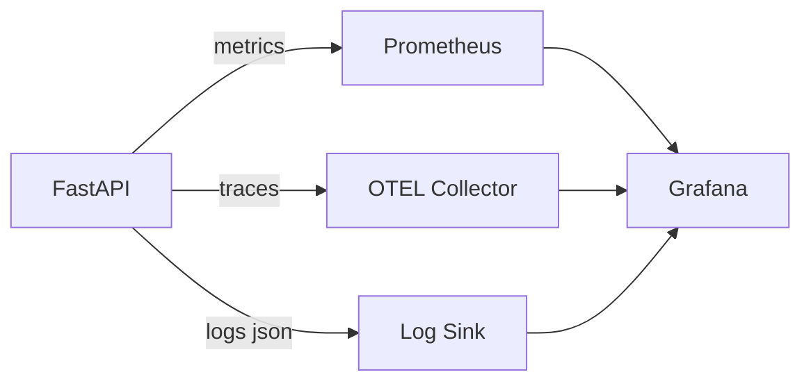

# Fase 7 - Observabilidad y Operacion (Tickets + Pasos + Comandos)

## 1. Objetivo de la fase

Incorporar visibilidad operativa del sistema mediante metricas, trazas y logs estructurados para diagnostico temprano y seguimiento de salud tecnica/negocio.

## 1.1 Fuentes base

- `diseno-sistema-ideas.md`
- `diseno-sistema-ideas-backlog.md`
- `diseno-sistema-ideas-escenarios.md`

---

## 2. Orden de ejecucion recomendado (Fase 7)

1. `F7-01` Integrar OpenTelemetry en API.
2. `F7-02` Exponer metricas Prometheus.
3. `F7-03` Dashboard tecnico en Grafana.
4. `F7-04` Dashboard de negocio.
5. `F7-05` Alertas y runbooks.

---

## 3. Tickets de Fase 7 (detalle paso a paso)

## Ticket F7-01 - Integrar OpenTelemetry en FastAPI

- Tipo: `TASK`
- Prioridad: `P1`
- Estimacion: `3 pts`
- Dependencias: `F4-*`

### Paso a paso

1. Instalar SDK y instrumentadores OTEL.
2. Configurar provider y exporter (OTLP recomendado).
3. Instrumentar FastAPI y SQLAlchemy.
4. Propagar `trace_id` en logs.
5. Verificar trazas de endpoints principales.

### Comandos (PowerShell)

```powershell
cd backend
uv add opentelemetry-api opentelemetry-sdk opentelemetry-exporter-otlp
uv add opentelemetry-instrumentation-fastapi opentelemetry-instrumentation-sqlalchemy
New-Item -ItemType File -Path src\app\adapters\outbound\observability\tracing.py -Force
```

### Criterios de aceptacion

- Se generan trazas por request API.
- Se observan spans de DB en operaciones principales.

---

## Ticket F7-02 - Exponer metricas Prometheus

- Tipo: `TASK`
- Prioridad: `P1`
- Estimacion: `2 pts`
- Dependencias: `F4-*`

### Paso a paso

1. Definir metricas base:
   - requests totales
   - latencia por endpoint
   - tasa de errores
2. Exponer endpoint `/metrics`.
3. Validar scrape desde Prometheus.

### Comandos (PowerShell)

```powershell
cd backend
uv add prometheus-fastapi-instrumentator
New-Item -ItemType File -Path src\app\adapters\outbound\observability\metrics.py -Force
```

### Criterios de aceptacion

- `/metrics` responde con formato Prometheus.
- Prometheus puede hacer scrape sin errores.

---

## Ticket F7-03 - Dashboard tecnico (Grafana)

- Tipo: `TASK`
- Prioridad: `P2`
- Estimacion: `3 pts`
- Dependencias: `F7-01`, `F7-02`

### Paso a paso

1. Configurar datasource Prometheus en Grafana.
2. Crear paneles:
   - requests por minuto
   - latencia p95/p99
   - error rate
3. Crear dashboard tecnico versionado (JSON).

### Comandos (PowerShell)

```powershell
cd infra
mkdir grafana\dashboards
New-Item -ItemType File -Path grafana\dashboards\api-technical-dashboard.json -Force
```

### Criterios de aceptacion

- Dashboard tecnico disponible y utilizable.

---

## Ticket F7-04 - Dashboard de negocio

- Tipo: `TASK`
- Prioridad: `P2`
- Estimacion: `3 pts`
- Dependencias: `F4-*`, `F7-02`

### Paso a paso

1. Definir KPIs de negocio:
   - ideas creadas por dia
   - ideas terminadas por periodo
   - promedio de rating
2. Exponer metricas de negocio desde API.
3. Crear dashboard de negocio en Grafana.

### Comandos (PowerShell)

```powershell
cd infra
New-Item -ItemType File -Path grafana\dashboards\business-dashboard.json -Force
```

### Criterios de aceptacion

- KPIs visibles y comprensibles para seguimiento producto.

---

## Ticket F7-05 - Alertas y runbooks iniciales

- Tipo: `TASK`
- Prioridad: `P2`
- Estimacion: `2 pts`
- Dependencias: `F7-03`

### Paso a paso

1. Definir alertas minimas:
   - error rate alto
   - latencia p95 alta
   - caida de servicio
2. Configurar reglas en Prometheus/Alertmanager.
3. Crear runbook por alerta.
4. Probar al menos una alerta simulada.

### Comandos (PowerShell)

```powershell
cd infra
mkdir monitoring\alerts,monitoring\runbooks
New-Item -ItemType File -Path monitoring\alerts\rules.yml -Force
New-Item -ItemType File -Path monitoring\runbooks\api-high-error-rate.md -Force
```

### Criterios de aceptacion

- Alertas activas con umbrales definidos.
- Runbooks disponibles para respuesta.

---

## 4. Diagrama de observabilidad (Mermaid)



---

## 5. Trazabilidad Fase 7 (ticket -> escenarios)

| Ticket | Escenarios impactados | Validacion principal |
|---|---|---|
| F7-01 | SCN-OBS-002 | Integracion tecnica |
| F7-02 | SCN-OBS-001 | Integracion tecnica |
| F7-03 | SCN-OBS-001, SCN-OBS-003 | Operativa |
| F7-04 | KPIs de negocio derivados de SCN-IDEA/SCN-RATE | Operativa |
| F7-05 | SCN-OBS-003 | Operativa + simulacion |

---

## 6. Checklist de cierre de Fase 7

- OTEL activo en API y DB.
- `/metrics` operativo y scrapeado.
- Dashboard tecnico disponible.
- Dashboard de negocio disponible.
- Alertas y runbooks iniciales definidos.

---

## 7. Definition of Done (DoD) Fase 7

La Fase 7 se considera cerrada cuando:
- El sistema es observable en metricas, trazas y logs.
- Existen dashboards accionables para equipo tecnico y producto.
- Hay alertas base para incidentes comunes.
