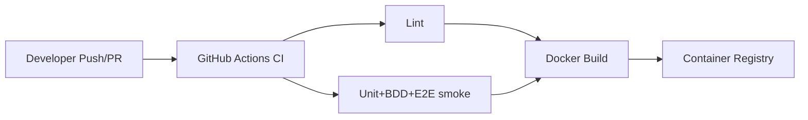

# Fase 8 - Contenerizacion y Despliegue Inicial (Tickets + Pasos + Comandos)

## 1. Objetivo de la fase

Preparar un proceso reproducible de build, test y entrega inicial usando Docker y GitHub Actions, habilitando ejecucion local consistente y CI automatizada por pull request.

## 1.1 Fuentes base

- `diseno-sistema-ideas.md`
- `diseno-sistema-ideas-backlog.md`
- `diseno-sistema-ideas-fase-6.md`

---

## 2. Orden de ejecucion recomendado (Fase 8)

1. `F8-01` Dockerfile backend.
2. `F8-02` Dockerfile frontend.
3. `F8-03` Docker Compose local completo.
4. `F8-04` Pipeline GitHub Actions (lint/test).
5. `F8-05` Build y publicacion de imagenes.

---

## 3. Tickets de Fase 8 (detalle paso a paso)

## Ticket F8-01 - Dockerfile backend

- Tipo: `TASK`
- Prioridad: `P0`
- Estimacion: `2 pts`
- Dependencias: `F2-*`, `F4-*`

### Paso a paso

1. Crear Dockerfile para backend Python slim.
2. Instalar `uv` y dependencias.
3. Copiar codigo y exponer puerto API.
4. Definir comando de arranque (`uvicorn`).
5. Validar build y run local.

### Comandos (PowerShell)

```powershell
cd backend
New-Item -ItemType File -Path Dockerfile -Force
docker build -t ideas-api:local .
docker run --rm -p 8000:8000 ideas-api:local
```

### Criterios de aceptacion

- Imagen backend construye sin errores.
- Endpoint `/health` responde dentro de contenedor.

---

## Ticket F8-02 - Dockerfile frontend

- Tipo: `TASK`
- Prioridad: `P0`
- Estimacion: `2 pts`
- Dependencias: `F5-*`

### Paso a paso

1. Crear Dockerfile para Next.js.
2. Instalar dependencias npm.
3. Ejecutar build de produccion.
4. Exponer puerto 3000.
5. Validar run local.

### Comandos (PowerShell)

```powershell
cd ..\frontend
New-Item -ItemType File -Path Dockerfile -Force
docker build -t ideas-web:local .
docker run --rm -p 3000:3000 ideas-web:local
```

### Criterios de aceptacion

- Imagen frontend construye y sirve app en puerto 3000.

---

## Ticket F8-03 - Docker Compose de entorno local completo

- Tipo: `TASK`
- Prioridad: `P0`
- Estimacion: `3 pts`
- Dependencias: `F8-01`, `F8-02`

### Paso a paso

1. Crear `docker-compose.yml` en raiz.
2. Definir servicios:
   - `api`
   - `web`
   - `postgres`
   - `prometheus` (opcional de base)
   - `grafana` (opcional de base)
3. Configurar redes y dependencias.
4. Definir volumen persistente para Postgres.
5. Levantar stack completo y validar healthchecks.

### Comandos (PowerShell)

```powershell
cd ..
New-Item -ItemType File -Path docker-compose.yml -Force
docker compose up -d --build
docker compose ps
docker compose down
```

### Criterios de aceptacion

- Stack levanta en un comando.
- API y Web operativas contra Postgres.

---

## Ticket F8-04 - Pipeline GitHub Actions lint + tests

- Tipo: `STORY`
- Prioridad: `P0`
- Estimacion: `5 pts`
- Dependencias: `F6-*`

### Paso a paso

1. Crear workflow `ci.yml`.
2. Definir jobs:
   - backend lint/test
   - frontend lint/test
   - bdd/e2e smoke (si aplica en CI inicial)
3. Cache de dependencias para velocidad.
4. Publicar artefactos de cobertura.
5. Configurar disparo por PR/push.

### Comandos (PowerShell)

```powershell
cd ..
mkdir .github\.github\workflows
New-Item -ItemType File -Path .github\workflows\ci.yml -Force
```

### Criterios de aceptacion

- Pipeline corre automaticamente en PR.
- Falla cuando tests/calidad fallan.

---

## Ticket F8-05 - Build y publicacion de imagenes

- Tipo: `TASK`
- Prioridad: `P1`
- Estimacion: `3 pts`
- Dependencias: `F8-04`

### Paso a paso

1. Definir tags de imagen por commit/release.
2. Configurar autenticacion al registry (GHCR recomendado).
3. Crear job de build y push para `api` y `web`.
4. Publicar digest y tags en artifacts.
5. Documentar estrategia de versionado de imagenes.

### Comandos (PowerShell)

```powershell
cd ..
New-Item -ItemType File -Path .github\workflows\release-images.yml -Force
```

### Criterios de aceptacion

- Imagenes publicadas con tags trazables.
- Proceso repetible y automatizado.

---

## 4. Diagrama de pipeline CI/CD (Mermaid)



---

## 5. Checklist de cierre de Fase 8

- Dockerfile backend funcional.
- Dockerfile frontend funcional.
- Compose completo levantable.
- CI con lint/tests activo.
- Publicacion de imagenes automatizada.

---

## 6. Definition of Done (DoD) Fase 8

La Fase 8 se considera cerrada cuando:
- El proyecto se puede ejecutar de forma consistente en contenedores.
- Cada PR ejecuta pipeline automatizada de calidad.
- Existen imagenes versionadas listas para despliegue.
