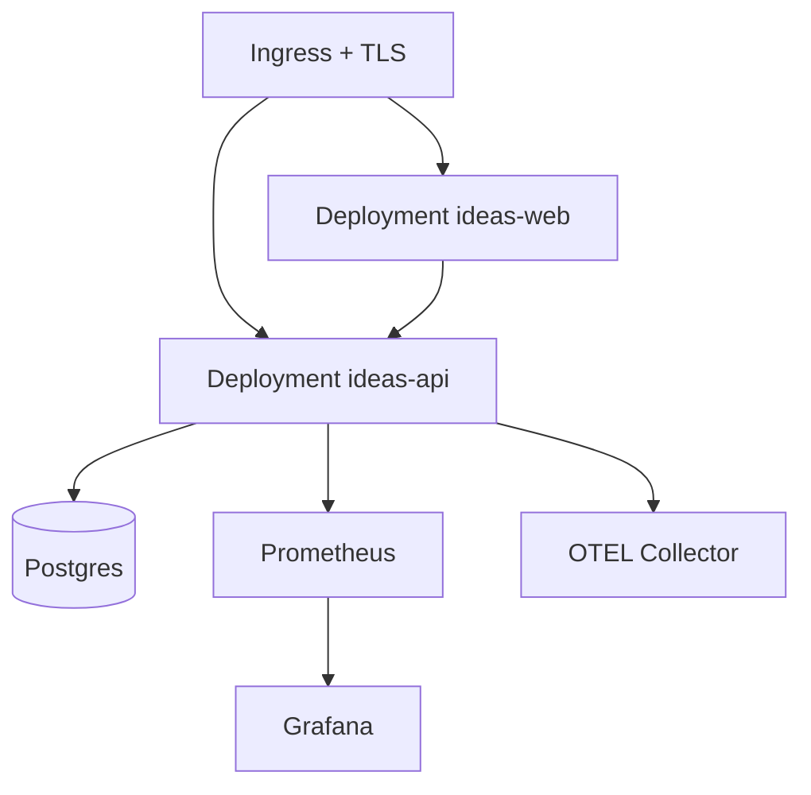

# Fase 9 - Kubernetes y Hardening Productivo (Tickets + Pasos + Comandos)

## 1. Objetivo de la fase

Llevar el sistema a operacion productiva en Kubernetes con seguridad, escalado, despliegues controlados y pruebas de carga para estabilizacion.

## 1.1 Fuentes base

- `diseno-sistema-ideas.md`
- `diseno-sistema-ideas-backlog.md`
- `diseno-sistema-ideas-fase-8.md`
- `diseno-sistema-ideas-fase-7.md`

---

## 2. Orden de ejecucion recomendado (Fase 9)

1. `F9-01` Manifiestos/Helm charts para API/Web.
2. `F9-02` Ingress, TLS y secretos.
3. `F9-03` Probes y autoscaling.
4. `F9-04` Estrategia de despliegue (rolling/canary).
5. `F9-05` Pruebas de carga y tuning.

---

## 3. Tickets de Fase 9 (detalle paso a paso)

## Ticket F9-01 - Definir manifests o Helm charts para API/Web

- Tipo: `TASK`
- Prioridad: `P1`
- Estimacion: `5 pts`
- Dependencias: `F8-05`

### Paso a paso

1. Elegir estrategia:
   - manifiestos puros o Helm.
2. Definir recursos base:
   - `Deployment` API
   - `Deployment` Web
   - `Service` API/Web
3. Configurar namespaces por entorno.
4. Parametrizar imagen/tag por release.
5. Validar despliegue en cluster dev.

### Comandos (PowerShell)

```powershell
cd infra
mkdir k8s\base,k8s\overlays\dev,k8s\overlays\staging
New-Item -ItemType File -Path k8s\base\api-deployment.yaml -Force
New-Item -ItemType File -Path k8s\base\web-deployment.yaml -Force
kubectl apply -f k8s/base
```

### Criterios de aceptacion

- API/Web desplegadas en cluster destino.

---

## Ticket F9-02 - Configurar Ingress, TLS y secretos

- Tipo: `TASK`
- Prioridad: `P1`
- Estimacion: `3 pts`
- Dependencias: `F9-01`

### Paso a paso

1. Definir Ingress para dominio API y Web.
2. Configurar TLS con cert-manager o gestionado.
3. Crear secretos para variables sensibles:
   - JWT secret
   - credenciales DB
4. Evitar secretos en texto plano en repo.
5. Validar acceso HTTPS.

### Comandos (PowerShell)

```powershell
cd infra
New-Item -ItemType File -Path k8s\base\ingress.yaml -Force
kubectl create secret generic ideas-api-secrets --from-literal=JWT_SECRET_KEY=change_me -n ideas-dev
kubectl apply -f k8s/base/ingress.yaml
```

### Criterios de aceptacion

- Acceso por HTTPS operativo.
- Secretos administrados de forma segura.

---

## Ticket F9-03 - Configurar probes y autoscaling (HPA)

- Tipo: `TASK`
- Prioridad: `P2`
- Estimacion: `3 pts`
- Dependencias: `F9-01`

### Paso a paso

1. Configurar `readinessProbe` y `livenessProbe` en API/Web.
2. Definir requests/limits de CPU y memoria.
3. Crear HPA para API basado en CPU/RPS.
4. Validar escalado con carga controlada.

### Comandos (PowerShell)

```powershell
cd infra
New-Item -ItemType File -Path k8s\base\api-hpa.yaml -Force
kubectl apply -f k8s/base/api-hpa.yaml
kubectl get hpa -n ideas-dev
```

### Criterios de aceptacion

- Pods saludables con probes activas.
- HPA escala bajo carga segun umbral.

---

## Ticket F9-04 - Estrategia de despliegue (rolling/canary)

- Tipo: `TASK`
- Prioridad: `P2`
- Estimacion: `3 pts`
- Dependencias: `F9-01`, `F9-03`

### Paso a paso

1. Definir estrategia por entorno:
   - dev/staging: rolling update.
   - prod: canary o blue/green (si capacidad lo permite).
2. Configurar parametros de rollout:
   - `maxUnavailable`
   - `maxSurge`
3. Definir procedimiento de rollback rapido.
4. Probar rollout y rollback en entorno no productivo.

### Comandos (PowerShell)

```powershell
kubectl rollout status deployment/ideas-api -n ideas-dev
kubectl rollout undo deployment/ideas-api -n ideas-dev
```

### Criterios de aceptacion

- Despliegues sin downtime apreciable.
- Rollback validado y documentado.

---

## Ticket F9-05 - Pruebas de carga y ajuste de recursos

- Tipo: `TASK`
- Prioridad: `P2`
- Estimacion: `5 pts`
- Dependencias: `F9-03`

### Paso a paso

1. Definir escenarios de carga:
   - login
   - listado de ideas
   - actualizacion estado/progreso
2. Ejecutar pruebas con herramienta (k6 recomendado).
3. Medir:
   - latencia p95/p99
   - error rate
   - consumo de CPU/memoria
4. Ajustar requests/limits y replicas.
5. Publicar reporte de rendimiento.

### Comandos (PowerShell)

```powershell
mkdir tests\performance
New-Item -ItemType File -Path tests\performance\ideas-load.js -Force
# Ejemplo si usas k6 local:
# k6 run tests/performance/ideas-load.js
```

### Criterios de aceptacion

- Existe baseline de rendimiento.
- Recursos de cluster ajustados con evidencia.

---

## 4. Diagrama de despliegue Kubernetes (Mermaid)



---

## 5. Checklist de cierre de Fase 9

- Manifiestos/Helm listos y aplicados.
- HTTPS y secretos configurados.
- Probes y HPA operativos.
- Rollout/rollback probado.
- Pruebas de carga ejecutadas y documentadas.

---

## 6. Definition of Done (DoD) Fase 9

La Fase 9 se considera cerrada cuando:
- El sistema despliega de forma confiable en Kubernetes.
- La operacion tiene mecanismos de seguridad, escalado y recuperacion.
- Existe evidencia de rendimiento y capacidad para produccion.
