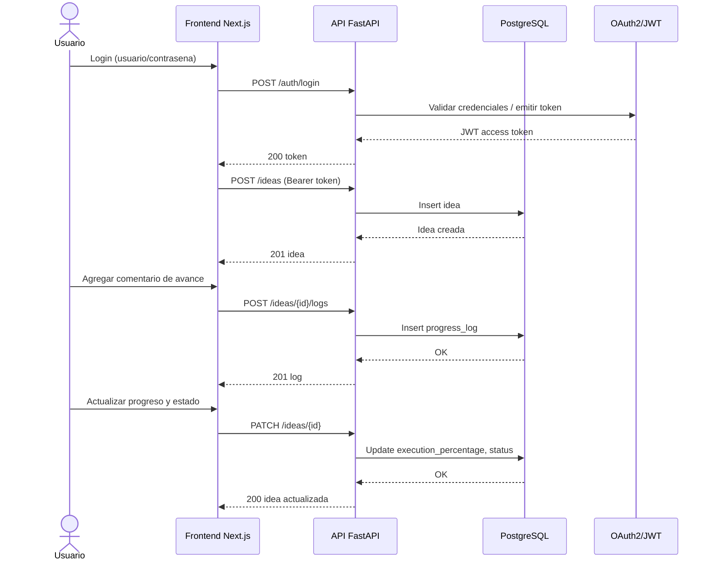

# Documento de Diseno del Sistema de Ideas Tracker

## 1) Vision del producto

Construir una plataforma web para capturar, priorizar, ejecutar y cerrar ideas de proyecto, con trazabilidad completa desde la concepcion hasta la evaluacion final.

Objetivos clave:
- Centralizar ideas en un solo lugar con CRUD completo.
- Medir avance real mediante porcentaje de ejecucion.
- Gestionar el ciclo de vida (`idea`, `in_progress`, `terminada`).
- Mantener historial de comentarios como bitacora del proyecto.
- Calificar resultado final para aprendizaje continuo.
- Asegurar la plataforma con OAuth2 + JWT.

## 2) Requerimientos funcionales

- CRUD de ideas:
  - Crear idea con titulo, descripcion y categoria opcional.
  - Consultar listado y detalle.
  - Actualizar estado, progreso, metadatos.
  - Eliminar (borrado logico recomendado).
- Autenticacion y autorizacion:
  - Login con OAuth2 Password Flow o Authorization Code (segun proveedor).
  - JWT firmado con expiracion.
  - Roles iniciales: `admin`, `user`.
- Progreso:
  - Campo `execution_percentage` entre 0 y 100.
  - Validaciones de negocio.
- Estado:
  - Enumeracion: `idea`, `in_progress`, `terminada`.
  - Reglas de transicion (evitar inconsistencias).
- Comentarios historicos:
  - `textarea` en frontend para registrar avances.
  - Persistencia en BD como evento historico.
  - Trazabilidad por fecha y autor.
- Calificacion final:
  - Rango sugerido 1-5 o 1-10.
  - Solo editable al terminar idea (regla recomendada).

## 3) Requerimientos no funcionales

- Seguridad:
  - JWT con expiracion corta + refresh token opcional.
  - Hash de contrasena con Argon2/Bcrypt (si gestionas usuarios locales).
  - Rate limiting para login.
- Escalabilidad:
  - Arquitectura stateless para backend.
  - Postgres como fuente de verdad.
- Observabilidad:
  - Logs estructurados JSON.
  - Metricas Prometheus.
  - Trazas distribuidas con OpenTelemetry.
  - Dashboards y alertas en Grafana.
- Calidad:
  - Pruebas unitarias con pytest.
  - Integracion/E2E con Playwright.
  - BDD con Gherkin integrado a suite de pruebas.
- Portabilidad:
  - Docker para entorno local y CI.
  - Kubernetes para despliegue posterior.

## 4) Stack tecnologico propuesto

- Backend: FastAPI + Uvicorn + `uv` (gestor/runner de entorno Python).
- ORM: SQLAlchemy 2.x + Alembic para migraciones.
- Base de datos: PostgreSQL.
- Frontend: React con Next.js (App Router).
- Testing backend: pytest, pytest-asyncio, pytest-cov, pytest-bdd.
- Testing integracion E2E: Playwright.
- CI/CD: GitHub Actions.
- Contenedores: Docker + Docker Compose (desarrollo), Kubernetes (produccion).
- Observabilidad: OpenTelemetry SDK + Prometheus + Grafana.

## 5) Arquitectura (C4)

### C1 - Contexto

Actores y sistemas:
- Usuario final: crea y da seguimiento a ideas.
- Admin: supervisa, gestiona usuarios/roles y calidad.
- Ideas Tracker System: aplicacion objetivo.
- Proveedor de identidad (opcional): OAuth2 provider externo.

### C2 - Contenedores

- Web App (Next.js):
  - UI, formularios, estado local, llamadas API.
- API Service (FastAPI):
  - Exposicion REST (y opcion gRPC futura).
  - Reglas de negocio, auth, validaciones.
- Database (PostgreSQL):
  - Persistencia transaccional.
- Observability Stack:
  - Prometheus (metricas), Grafana (visualizacion), OTEL collector (opcional).

### C3 - Componentes del backend

- `AuthModule`: login, validacion JWT, scopes/roles.
- `IdeaModule`: CRUD de ideas, estado, porcentaje.
- `ProgressLogModule`: comentarios/historial.
- `RatingModule`: calificacion final.
- `Repository Layer`: acceso a datos via SQLAlchemy.
- `TelemetryModule`: instrumentacion OTEL y metricas.

## 6) Diagrama de secuencia (flujo principal)



## 7) Modelo de datos relacional (normalizado)

### Entidades principales

- `users`
- `roles`
- `user_roles` (N:M)
- `ideas`
- `idea_progress_logs`
- `idea_ratings`

### Propuesta SQL (3FN)

```sql
CREATE TABLE roles (
  id BIGSERIAL PRIMARY KEY,
  name VARCHAR(50) UNIQUE NOT NULL
);

CREATE TABLE users (
  id BIGSERIAL PRIMARY KEY,
  email VARCHAR(255) UNIQUE NOT NULL,
  password_hash TEXT NOT NULL,
  is_active BOOLEAN NOT NULL DEFAULT TRUE,
  created_at TIMESTAMPTZ NOT NULL DEFAULT NOW()
);

CREATE TABLE user_roles (
  user_id BIGINT NOT NULL REFERENCES users(id) ON DELETE CASCADE,
  role_id BIGINT NOT NULL REFERENCES roles(id) ON DELETE CASCADE,
  PRIMARY KEY (user_id, role_id)
);

CREATE TABLE ideas (
  id BIGSERIAL PRIMARY KEY,
  owner_id BIGINT NOT NULL REFERENCES users(id),
  title VARCHAR(200) NOT NULL,
  description TEXT NOT NULL,
  status VARCHAR(20) NOT NULL CHECK (status IN ('idea','in_progress','terminada')),
  execution_percentage NUMERIC(5,2) NOT NULL DEFAULT 0 CHECK (execution_percentage >= 0 AND execution_percentage <= 100),
  created_at TIMESTAMPTZ NOT NULL DEFAULT NOW(),
  updated_at TIMESTAMPTZ NOT NULL DEFAULT NOW(),
  deleted_at TIMESTAMPTZ NULL
);

CREATE TABLE idea_progress_logs (
  id BIGSERIAL PRIMARY KEY,
  idea_id BIGINT NOT NULL REFERENCES ideas(id) ON DELETE CASCADE,
  author_id BIGINT NOT NULL REFERENCES users(id),
  comment TEXT NOT NULL,
  progress_snapshot NUMERIC(5,2) NOT NULL CHECK (progress_snapshot >= 0 AND progress_snapshot <= 100),
  status_snapshot VARCHAR(20) NOT NULL CHECK (status_snapshot IN ('idea','in_progress','terminada')),
  created_at TIMESTAMPTZ NOT NULL DEFAULT NOW()
);

CREATE TABLE idea_ratings (
  id BIGSERIAL PRIMARY KEY,
  idea_id BIGINT NOT NULL UNIQUE REFERENCES ideas(id) ON DELETE CASCADE,
  rating SMALLINT NOT NULL CHECK (rating BETWEEN 1 AND 10),
  summary TEXT NULL,
  created_at TIMESTAMPTZ NOT NULL DEFAULT NOW()
);
```

Notas de normalizacion:
- 1FN: atributos atomicos (sin campos multivaluados).
- 2FN: tablas puente para relaciones N:M (`user_roles`).
- 3FN: separacion de catalogos (`roles`) y eventos (`idea_progress_logs`) para evitar dependencias transitivas.

## 8) Diseno de API REST (v1)

Base path: `/api/v1`

- Auth:
  - `POST /auth/login`
  - `POST /auth/refresh` (opcional)
- Ideas:
  - `POST /ideas`
  - `GET /ideas`
  - `GET /ideas/{idea_id}`
  - `PATCH /ideas/{idea_id}`
  - `DELETE /ideas/{idea_id}` (soft delete)
- Logs / Traza:
  - `POST /ideas/{idea_id}/logs`
  - `GET /ideas/{idea_id}/logs`
- Rating:
  - `POST /ideas/{idea_id}/rating`
  - `PATCH /ideas/{idea_id}/rating`
  - `GET /ideas/{idea_id}/rating`

Reglas recomendadas:
- `terminada` requiere `execution_percentage = 100`.
- No permitir `rating` hasta estado `terminada`.
- Registrar log automatico al cambiar porcentaje/estado.

## 9) Seguridad (OAuth2 + JWT)

- Flujo minimo viable:
  - Login -> emite `access_token` JWT.
  - Middleware valida firma, exp, aud, iss (si aplica).
- Claims sugeridos:
  - `sub` (user_id), `email`, `roles`, `exp`, `iat`.
- Buenas practicas:
  - Secretos por variables de entorno.
  - Rotacion de claves.
  - Proteccion CORS y cabeceras seguras.
  - Auditoria basica de eventos de login y acciones sensibles.

## 10) Estrategia de pruebas

### 10.1 Unitarias (pytest)

Cobertura objetivo inicial: >= 80%.

Casos clave:
- Validaciones de dominio:
  - rango de porcentaje.
  - transiciones de estado.
  - reglas de rating.
- Servicios:
  - CRUD de ideas.
  - creacion de logs.
  - auth/token.
- Repositorios:
  - consultas y persistencia con fixtures.

### 10.2 BDD (Gherkin + pytest-bdd)

Ejemplo de feature:

```gherkin
Feature: Gestion de estado de ideas
  Scenario: Marcar idea como terminada
    Given existe una idea en estado "in_progress" con 90% de ejecucion
    When actualizo la idea a estado "terminada" y 100% de ejecucion
    Then la API responde exitosamente
    And se registra un log de progreso
```

Recomendacion:
- Guardar features en `tests/bdd/features`.
- Implementar steps en `tests/bdd/steps`.
- Incluir estos escenarios dentro de la suite de CI.

### 10.3 Integracion y E2E (Playwright)

Escenarios:
- Login exitoso/fallido.
- Crear idea desde UI.
- Actualizar progreso y estado.
- Agregar comentario y verificar historial.
- Calificar idea terminada.

## 11) Observabilidad

- OpenTelemetry:
  - Instrumentar FastAPI, SQLAlchemy y cliente HTTP.
  - Propagar `trace_id` en logs.
- Prometheus:
  - Exponer `/metrics`.
  - Metricas: latencia por endpoint, tasa de error, solicitudes por segundo.
- Grafana:
  - Dashboards de API, DB y negocio (ideas creadas, ideas terminadas, promedio rating).
- Alertas sugeridas:
  - Error rate > 5% por 5 min.
  - Latencia p95 > umbral definido.

## 12) Contenedores y despliegue

### Docker (fase inicial)

- Backend: imagen Python slim + `uv`.
- Frontend: imagen Node LTS.
- Compose para local:
  - `api`, `web`, `postgres`, `prometheus`, `grafana`.

### Kubernetes (fase posterior)

- Recursos:
  - Deployments: `ideas-api`, `ideas-web`.
  - StatefulSet/servicio gestionado para Postgres (segun entorno).
  - ConfigMaps/Secrets.
  - Ingress + TLS.
- Practicas:
  - Readiness/liveness probes.
  - HPA para escalado.
  - Network policies.

## 13) CI/CD con GitHub Actions

Pipeline sugerido:
1. `lint-and-test`:
   - instalar dependencias backend/frontend.
   - correr lint.
   - ejecutar pytest (incluye BDD).
2. `e2e`:
   - levantar stack temporal (docker compose).
   - ejecutar Playwright.
3. `build`:
   - construir imagenes docker.
4. `security`:
   - scan de dependencias y contenedores.
5. `deploy`:
   - dev/staging automatico.
   - produccion con aprobacion manual.

## 14) Fases del proyecto (ordenadas) y tareas

## Fase 0 - Descubrimiento y alineacion

Objetivo: cerrar alcance funcional y tecnico.

Tareas:
- Definir alcance MVP y backlog inicial.
- Acordar reglas de negocio (estado/progreso/rating).
- Definir NFRs (seguridad, rendimiento, disponibilidad).
- Seleccionar convenciones de codigo, ramas y versionado API.

Entregables:
- Documento de alcance.
- Lista priorizada de historias de usuario.

## Fase 1 - Base de arquitectura y repositorio

Objetivo: dejar estructura inicial lista para construir.

Tareas:
- Inicializar monorepo o multi-repo (recomendado monorepo).
- Crear servicios base: `backend/`, `frontend/`, `infra/`, `docs/`.
- Configurar `uv` y entorno Python.
- Configurar Next.js y tooling basico.
- Definir estructura C4 inicial en `docs/architecture`.

Entregables:
- Proyecto inicial corriendo localmente.
- Diagrama C4 C1/C2 inicial.

## Fase 2 - Modelo de datos y persistencia

Objetivo: implementar schema relacional y migraciones.

Tareas:
- Modelar entidades SQLAlchemy.
- Configurar Alembic.
- Crear migracion inicial para usuarios, ideas, logs, ratings.
- Agregar indices y constraints.
- Crear script de seed basico.

Entregables:
- BD en Postgres con migraciones versionadas.
- ERD (diagrama relacional normalizado).

## Fase 3 - Seguridad y autenticacion

Objetivo: asegurar acceso al sistema.

Tareas:
- Implementar login OAuth2/JWT.
- Crear middleware/dependencias de autorizacion.
- Definir roles y permisos minimos.
- Implementar expiracion de token y manejo de errores auth.
- Pruebas unitarias de auth.

Entregables:
- Endpoints de auth funcionales.
- Matriz basica de permisos.

## Fase 4 - API de dominio (ideas, logs, rating)

Objetivo: construir el nucleo funcional.

Tareas:
- CRUD de ideas.
- Actualizacion de estado y porcentaje con validaciones.
- Registro de comentarios historicos.
- Registro/consulta de rating final.
- Versionado de API y documentacion OpenAPI.

Entregables:
- API REST v1 completa para MVP.
- Reglas de negocio implementadas y testeadas.

## Fase 5 - Frontend en Next.js

Objetivo: exponer funcionalidad mediante UI usable.

Tareas:
- Pantalla de login y manejo de sesion JWT.
- Vista listado de ideas.
- Formulario crear/editar idea.
- Vista detalle con timeline de comentarios.
- Componente de progreso, estado y rating.

Entregables:
- Flujo E2E de usuario de punta a punta.
- UI funcional para operaciones principales.

## Fase 6 - Calidad, BDD y pruebas

Objetivo: asegurar calidad funcional y tecnica.

Tareas:
- Crear escenarios Gherkin de historias criticas.
- Implementar steps pytest-bdd.
- Unit tests para dominio/servicios.
- Integration/E2E tests con Playwright.
- Reportes de cobertura y gates de calidad.

Entregables:
- Suite automatizada en verde.
- Cobertura acordada alcanzada.

## Fase 7 - Observabilidad y operacion

Objetivo: visibilidad de salud tecnica y negocio.

Tareas:
- Integrar OpenTelemetry en API.
- Exponer metricas Prometheus.
- Crear dashboards Grafana (tecnico + negocio).
- Definir alertas y runbooks iniciales.

Entregables:
- Telemetria de extremo a extremo.
- Dashboards operativos activos.

## Fase 8 - Contenerizacion y despliegue inicial

Objetivo: preparar despliegue repetible.

Tareas:
- Dockerfiles optimizados backend/frontend.
- Docker Compose para entorno local/integracion.
- Pipeline GitHub Actions para test + build.
- Publicacion de imagenes a registry.

Entregables:
- Build reproducible.
- CI funcionando en cada PR.

## Fase 9 - Kubernetes y hardening productivo

Objetivo: escalar y robustecer para produccion.

Tareas:
- Manifiestos o Helm charts.
- Configurar Ingress, TLS y secretos.
- HPA, probes y politicas de recursos.
- Estrategia de despliegue (rolling/canary).
- Pruebas de carga y ajuste de limites.

Entregables:
- Entorno Kubernetes desplegado.
- Checklist de produccion validado.

## 15) Plan de trabajo sugerido (macro)

- Sprint 1: Fases 0-2.
- Sprint 2: Fases 3-4.
- Sprint 3: Fases 5-6.
- Sprint 4: Fases 7-8.
- Sprint 5: Fase 9 + estabilizacion.

## 16) Riesgos y mitigaciones

- Riesgo: complejidad temprana por demasiadas tecnologias.
  - Mitigacion: enfocar MVP primero; habilitar gRPC y Kubernetes en etapas posteriores.
- Riesgo: baja calidad de pruebas BDD por mala redaccion de escenarios.
  - Mitigacion: Given/When/Then orientado a negocio y revision en PR.
- Riesgo: deuda tecnica de observabilidad.
  - Mitigacion: instrumentar desde fase media, no al final.

## 17) Definition of Done (DoD) por historia

- Criterios funcionales cumplidos.
- Pruebas unitarias y BDD pasando.
- E2E relevante pasando.
- Documentacion API actualizada.
- Metricas y logs para el flujo creados.
- Revisado por pares en PR.

---

Este documento sirve como baseline de diseno. Se recomienda versionarlo y actualizarlo por iteracion (MVP -> v1 -> v2), manteniendo trazabilidad entre requerimientos, arquitectura, pruebas y despliegue.

## 18) Backend con arquitectura hexagonal (detallado)

### 18.1 Principios de aplicacion

- El dominio no conoce frameworks (ni FastAPI, ni SQLAlchemy).
- Los casos de uso orquestan reglas de negocio.
- Los adaptadores concretan entradas/salidas externas.
- La dependencia siempre apunta hacia adentro (infra -> aplicacion -> dominio).

### 18.2 Capas y responsabilidades

- `domain`:
  - Entidades y value objects (`Idea`, `IdeaStatus`, `Rating`).
  - Reglas invariantes (porcentaje 0-100, rating solo en terminada, etc).
  - Interfaces de repositorio como puertos de salida.
- `application`:
  - Casos de uso (`CreateIdeaUseCase`, `UpdateIdeaUseCase`, `AddProgressLogUseCase`).
  - DTOs de entrada/salida.
  - Servicios de aplicacion y politicas transversales.
- `adapters/inbound`:
  - REST controllers (FastAPI routers).
  - Mapeo request/response <-> DTO.
  - Validaciones de borde.
- `adapters/outbound`:
  - Persistencia con SQLAlchemy.
  - Cliente JWT/OAuth2 provider.
  - Publicacion de metricas/trazas.
- `bootstrap`:
  - Wiring de dependencias (factories/DI manual).
  - Configuracion (settings por entorno).

### 18.3 Estructura sugerida de carpetas (backend)

```text
backend/
  src/
    app/
      main.py
      bootstrap/
        container.py
        settings.py
      domain/
        idea/
          entities.py
          value_objects.py
          services.py
          exceptions.py
        auth/
          entities.py
        shared/
          events.py
      application/
        idea/
          dto.py
          ports.py
          use_cases/
            create_idea.py
            update_idea.py
            delete_idea.py
            list_ideas.py
            add_progress_log.py
            rate_idea.py
        auth/
          dto.py
          ports.py
          use_cases/
            login.py
            refresh_token.py
      adapters/
        inbound/
          rest/
            routers/
              auth_router.py
              ideas_router.py
              logs_router.py
              ratings_router.py
            schemas/
              auth_schema.py
              idea_schema.py
        outbound/
          persistence/
            sqlalchemy/
              models.py
              mappers.py
              repositories/
                idea_repository.py
                user_repository.py
              session.py
          security/
            jwt_service.py
            password_hasher.py
          observability/
            metrics.py
            tracing.py
      tests/
        unit/
        integration/
        bdd/
```

### 18.4 Puertos (ports) recomendados

Puertos de salida (interfaces en `application/*/ports.py`):
- `IdeaRepositoryPort`
- `ProgressLogRepositoryPort`
- `RatingRepositoryPort`
- `UserRepositoryPort`
- `TokenServicePort`
- `PasswordHasherPort`
- `ClockPort` (util para pruebas deterministicas)

Puertos de entrada:
- Casos de uso invocados por routers REST.
- En una evolucion futura, pueden invocarse tambien desde gRPC sin tocar dominio.

### 18.5 Flujo de un caso de uso (ejemplo `UpdateIdea`)

1. `ideas_router.py` recibe `PATCH /ideas/{id}`.
2. Convierte request a `UpdateIdeaInputDTO`.
3. Ejecuta `UpdateIdeaUseCase`.
4. El caso de uso consulta repositorio via puerto.
5. Entidad de dominio valida transicion y reglas.
6. Repositorio persiste cambios.
7. Caso de uso retorna `UpdateIdeaOutputDTO`.
8. Router mapea a response JSON.

### 18.6 Convenciones de codigo recomendadas

- Un caso de uso por archivo.
- Dominio sin imports de `fastapi`, `sqlalchemy`, `pydantic`.
- Mapeadores explicitos entre:
  - Schema REST -> DTO
  - DTO -> Entidad
  - Entidad -> Modelo ORM
- Excepciones de dominio propias (`InvalidStatusTransition`, `InvalidRating`, etc).

### 18.7 Testing en hexagonal

- Unit test de dominio:
  - sin DB, sin framework.
  - foco en reglas e invariantes.
- Unit test de casos de uso:
  - repos fake/in-memory.
  - assertions de orquestacion.
- Integration test de adaptadores:
  - SQLAlchemy + Postgres de prueba.
- Contract test de API:
  - validar status code, payload y auth.

### 18.8 Ejemplo de fases adaptadas a hexagonal (backend)

- Fase backend A: crear `domain` y `application` (sin FastAPI).
- Fase backend B: integrar adaptadores REST y persistencia.
- Fase backend C: cerrar observabilidad, seguridad avanzada y hardening.

## 19) Frontend por modulos/features (Next.js)

### 19.1 Enfoque recomendado

- Organizar por feature, no por tipo tecnico global.
- Mantener `shared` pequeno y estable.
- Cada modulo encapsula UI + hooks + servicios + tests.

### 19.2 Estructura sugerida de carpetas (frontend)

```text
frontend/
  src/
    app/
      (public)/
        login/
          page.tsx
      (private)/
        ideas/
          page.tsx
          [ideaId]/
            page.tsx
      layout.tsx
    modules/
      auth/
        components/
          LoginForm.tsx
        hooks/
          useLogin.ts
        services/
          authApi.ts
        model/
          types.ts
        tests/
      ideas/
        components/
          IdeaForm.tsx
          IdeaCard.tsx
          IdeaStatusBadge.tsx
          ExecutionProgressBar.tsx
        hooks/
          useIdeasList.ts
          useIdeaDetail.ts
          useIdeaMutations.ts
        services/
          ideasApi.ts
        model/
          idea.types.ts
          idea.mappers.ts
        tests/
      progress-logs/
        components/
          ProgressLogTextarea.tsx
          ProgressLogTimeline.tsx
        hooks/
          useProgressLogs.ts
        services/
          progressLogsApi.ts
        tests/
      ratings/
        components/
          IdeaRatingForm.tsx
          IdeaRatingSummary.tsx
        hooks/
          useIdeaRating.ts
        services/
          ratingsApi.ts
        tests/
    shared/
      ui/
      lib/
        apiClient.ts
        authStorage.ts
      config/
      types/
```

### 19.3 Features clave y responsabilidades

- `auth`:
  - login, refresh token, guardas de ruta.
- `ideas`:
  - CRUD visual, filtros, estado, porcentaje.
- `progress-logs`:
  - textarea de seguimiento y timeline historico.
- `ratings`:
  - calificacion final y resumen de cierre.
- `shared`:
  - componentes base (botones, inputs, modal), cliente HTTP, utilidades.

### 19.4 Patrones recomendados en frontend

- Server Components para lectura inicial cuando aporte SEO/performance.
- Client Components para formularios interactivos.
- React Query (o SWR) para cache, invalidacion y sincronizacion.
- Zod para validacion de formularios en cliente (y opcionalmente compartir schema).
- Middleware de Next.js para proteger rutas privadas.

### 19.5 Estado y comunicacion entre modulos

- Estado remoto: gestionado por cache de queries.
- Estado local de UI: hooks por feature.
- Evitar store global hasta que sea necesario.
- Si crece complejidad, introducir store por dominio (no store unico gigante).

### 19.6 Estrategia de pruebas frontend por modulo

- Unit:
  - componentes y hooks (Vitest/Jest + Testing Library).
- Integration:
  - pruebas de pantallas por feature con mocks controlados.
- E2E:
  - Playwright cubre flujos cross-feature:
    - login -> crear idea -> actualizar progreso -> comentar -> calificar.

### 19.7 Contratos frontend-backend

- Definir contratos OpenAPI como fuente de verdad.
- Generar tipos TypeScript desde OpenAPI para evitar drift.
- Manejar errores estandar (`code`, `message`, `details`) en todas las features.

### 19.8 Orden de implementacion sugerido de features

1. `auth`
2. `ideas` (listado + crear)
3. `ideas` (detalle + actualizar estado/progreso)
4. `progress-logs`
5. `ratings`
6. refinamiento UX, accesibilidad y rendimiento
